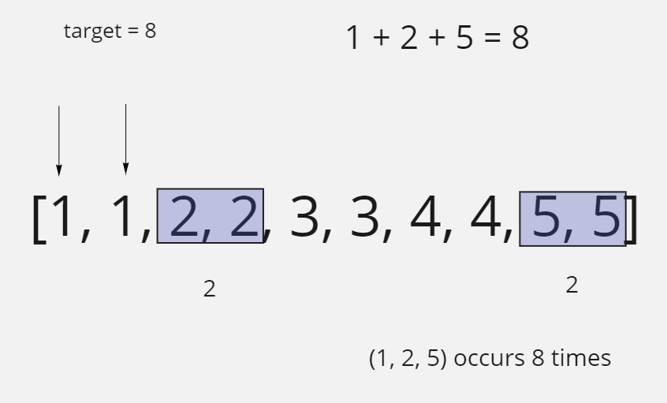

# 3Sum With Multiplicity

## Difficulty


## Problem

Given an integer array arr, and an integer target, return the number of tuples i, j, k such that i < j < k and arr[i] + arr[j] + arr[k] == target.

As the answer can be very large, return it modulo 109 + 7.

### Example 1

```
Input: arr = [1,1,2,2,3,3,4,4,5,5], target = 8
Output: 20
Explanation:
Enumerating by the values (arr[i], arr[j], arr[k]):
(1, 2, 5) occurs 8 times;
(1, 3, 4) occurs 8 times;
(2, 2, 4) occurs 2 times;
(2, 3, 3) occurs 2 times.
```

### Example 2

```
Input: arr = [1,1,2,2,2,2], target = 5
Output: 12
Explanation:
arr[i] = 1, arr[j] = arr[k] = 2 occurs 12 times:
We choose one 1 from [1,1] in 2 ways,
and two 2s from [2,2,2,2] in 6 ways.
```

### Constraints

`3 <= arr.length <= 3000`

`0 <= arr[i] <= 100`

`0 <= target <= 300`

<details>
  <summary>Solutions (Click to expand)</summary>

### Explanation

#### Three Pointers Counting Combinations

##### Intuition

If we take the strategy [3Sum](../3sum), then we can count to total nubmer of unique combinations of three numbers whoes sum equals `target`. This strategy skips duplicate numbers to prevent counting duplicate combinations. For this problem we want to do the opposite and count all of the duplicate combinations. To do this we'll want to find unique combinations of 3 numbers whoes sum equals `target`. Then for that combination check if we can build the same combination using different positions in the array. If we can add that combination to the number of combinations that equal `target`.

For example if we have an array with only one unique combination that equals `target` which is `[1, 1, 1]` then we'll need to find all other combinations of `[1, 1, 1]` in the array where `i < j < k`

```
target = 3

            (i j k)

[1 1 1 1 1] (0 1 2)
 ^ ^ ^

[1 1 1 1 1] (0 1 3)
 ^ ^   ^

[1 1 1 1 1] (0 1 4)
 ^ ^     ^

[1 1 1 1 1] (0 2 3)
 ^   ^ ^

[1 1 1 1 1] (0 2 4)
 ^   ^   ^

[1 1 1 1 1] (0 3 4)
 ^     ^ ^

[1 1 1 1 1] (1 2 3)
   ^ ^ ^

[1 1 1 1 1] (1 2 4)
   ^ ^   ^

[1 1 1 1 1] (1 3 4)
   ^   ^ ^

[1 1 1 1 1] (2 3 4)
     ^ ^ ^
```

For an array of length `5` and and only one type of number, then we can find the total number of combinations where `i < j < k` and `arr[i] + arr[j] + arr[k] == target` by using `n! * (r! * (n−r)!)`.

Now say that we add a new number to the array `2` and our array has one unique combinations that equals `target` `[1, 1, 2]`. In the arry we'll need to find all other combinations of `[1, 1, 2]` in the array where `i < j < k`

```
target = 4

[1 1 1 2 2 2] (0 1 3)
 ^ ^   ^

[1 1 1 2 2 2] (0 1 4)
 ^ ^     ^

[1 1 1 2 2 2] (0 1 5)
 ^ ^       ^

[1 1 1 2 2 2] (0 2 3)
 ^   ^ ^

[1 1 1 2 2 2] (0 2 4)
 ^   ^   ^

[1 1 1 2 2 2] (0 2 5)
 ^   ^     ^

[1 1 1 2 2 2] (1 2 3)
   ^ ^ ^

[1 1 1 2 2 2] (1 2 4)
   ^ ^   ^

[1 1 1 2 2 2] (1 2 5)
   ^ ^     ^
```

In the event where `arr[i] + arr[j] + arr[k]` and `arr[j] != arr[k]` we'll need to find the multiplicity of `arr[j]` and `arr[k]` in the array. This means for `arr[i]` where `arr[j] != arr[k]` the total number of number of combinations we can make is the frequency of `arr[j]` and the frequency of `arr[k]` where `arr[j] == arr[j + 1]` and `arr[k] == arr[k - 1]` and where `i < j < k`. The total number of combinations is product the of the multiplicity of `arr[j]` and `arr[k]`.



In the event where In the event where `arr[i] + arr[j] + arr[k]` and `arr[j] == arr[k]` then the total number of combinations is the number of pairs we can make out of the numbers between `j` and `k` which can be calculated as `(k - j + 1) * (k - 1) / 2`


##### Implementation

We'll start with the same implemantation as [3Sum](../3sum) where we use 3 pointers `i`, `j`, and `k` to find a combination where `arr[i] + arr[j] + arr[k] == target`. The pointers must be `i < j < k` so `j` will start at `i + 1` and `k` will start at `n - 1` where `n` is the length of the array.

if `arr[i] + arr[j] + arr[k] > target` we will decrement `k` to decrease the sum. If `arr[i] + arr[j] + arr[k] < target` we will increment `j` to increase the sum.

If `arr[i] + arr[j] + arr[k] == target` then we have found a combination. Now we will check if `arr[j] == arr[k]` then we know that `arr[j], arr[j + 1], ... arr[n - 1]` are all the same numbers. We can find all of the combinations by using `(k - j + 1) * (k - 1) / 2` which will find the number off possible pairs we can make out of the numbers between `j` and `k`

Time: `O(N^2)`

Space: `O(1)`

- [JavaScript](./3sum-with-multiplicity.js)
- [TypeScript](./3sum-with-multiplicity.ts)
- [Java](./3sum-with-multiplicity.java)
- [Go](./3sum-with-multiplicity.go)

</details>
