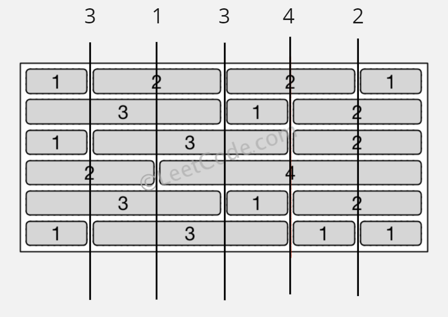
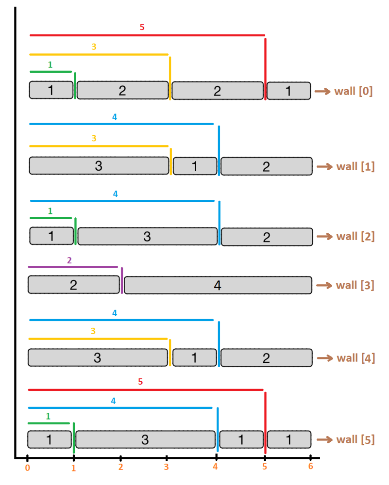

# Brick Wall

## Difficulty


## Problem

There is a brick wall in front of you. The wall is rectangular and has several rows of bricks. The bricks have the same height but different width. You want to draw a vertical line from the top to the bottom and cross the least bricks.

The brick wall is represented by a list of rows. Each row is a list of integers representing the width of each brick in this row from left to right.

If your line go through the edge of a brick, then the brick is not considered as crossed. You need to find out how to draw the line to cross the least bricks and return the number of crossed bricks.

You cannot draw a line just along one of the two vertical edges of the wall, in which case the line will obviously cross no bricks.

### Example 1

```
Input: [[1,2,2,1],
        [3,1,2],
        [1,3,2],
        [2,4],
        [3,1,2],
        [1,3,1,1]]

Output: 2
```


### Constraints

`The width sum of bricks in different rows are the same and won't exceed INT_MAX.`

`The number of bricks in each row is in range [1,10,000]. The height of wall is in range [1,10,000]. Total number of bricks of the wall won't exceed 20,000.`

<details>
  <summary>Solutions (Click to expand)</summary>

### Explanation

#### Solution

##### Intuition

Since a line that goes between the edges of a brick is not considered to be crossed, we want to draw a line that passes throught the most edges.

If `n` is the width of the rectangle we can draw at most `n - 1` lines. For everyone of these lines we need to count how many edges they can go through. We can do so by counting the positions of edges at each row and add together all the edges for each line and find the line with the most amount of edges

##### Implementation



We'll keep track of the edges for each line by storing them in a HashMap. The `map[i]` will contain the number of edges that the _ith_ line crosses. We need to iterate over the rows to find the positions of every edge. They can be found by adding up the length of bricks up until an edge.



After iterating over the rows we need to find the edge that crosses the most edges by taking the max among all of the values in the HashMap. Then finding the bricks crossed by that line can be found by taking the difference between the number of rows and the edges crossed by that line.

Time: `O(H * W)` Where `H` is the height and `W` is the width of the rectangle

Space: `O(W)`

- [JavaScript](./brick-wall.js)
- [TypeScript](./brick-wall.ts)
- [Java](./brick-wall.java)
- [Go](./brick-wall.go)

</details>
