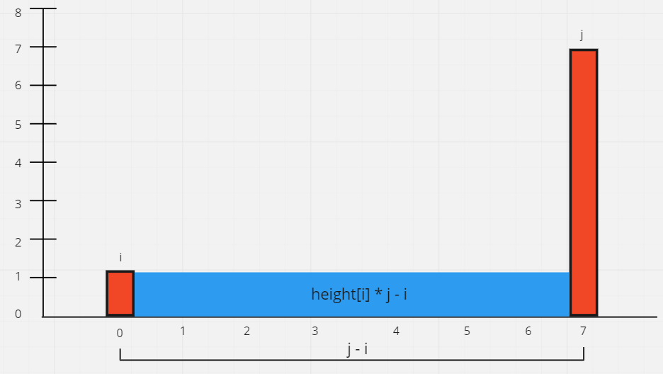
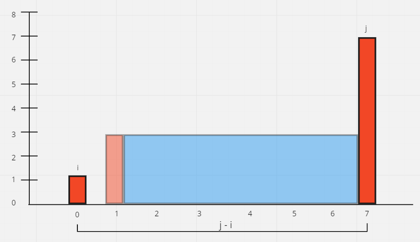
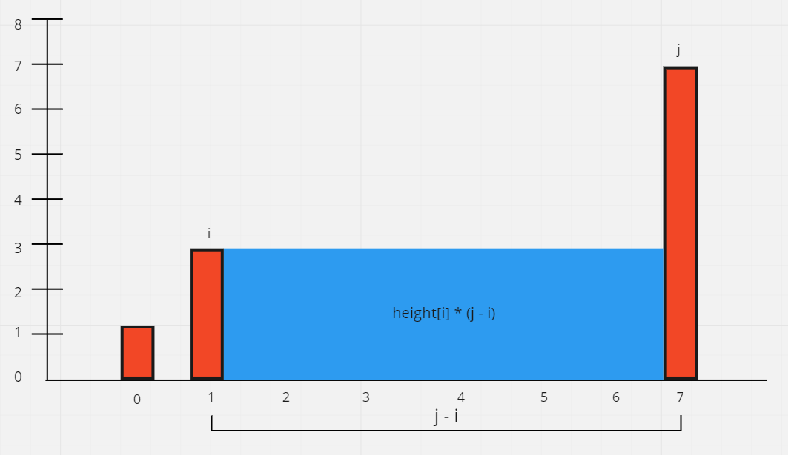

# Container With Most Water

## Difficulty


## Problem

Given n non-negative integers a1, a2, ..., an , where each represents a point at coordinate (i, ai). n vertical lines are drawn such that the two endpoints of the line i is at (i, ai) and (i, 0). Find two lines, which, together with the x-axis forms a container, such that the container contains the most water.

Notice that you may not slant the container.

### Example 1

```
Input: height = [1,8,6,2,5,4,8,3,7]
Output: 49
Explanation: The above vertical lines are represented by array [1,8,6,2,5,4,8,3,7]. In this case, the max area of water (blue section) the container can contain is 49.
```

### Example 2

```
Input: height = [1,1]
Output: 1
```

### Example 3

```
Input: height = [4,3,2,1,4]
Output: 16
```

### Example 4

```
Input: height = [1,2,1]
Output: 2
```

### Constraints

`n == height.length`

`2 <= n <= 3 * 104`

`0 <= height[i] <= 3 * 104`

<details>
  <summary>Solutions (Click to expand)</summary>

### Explanation

#### Two Pointers

A container can be represented as two points in the array, `i` and `j`, that can hold at the most the the minimum height of the two pointers, `min(height[i], height[j])`, times the length between the pointers, `j - 1`



Here we can see that the amount of water that we can hold is largely deterministic by the height of the shorter of the two pointers. If we want a larger volume we would need to replace the shorter edge with an edge that is closer to the larger edge and has a height that makes up for the loss in distance and makes for a larger resulting volume.



Now our new volume is the shorter of the two pointers \* the length between the two pointers.



This would go one until the two pointers meet, `j - i = 0`, and we can't hold anymore water

Time: `O(N)` where `N` is the length of the array

Space: `O(1)`

- [JavaScript](./container-with-most-water.js)
- [TypeScript](./container-with-most-water.ts)
- [Java](./container-with-most-water.java)
- [Go](./container-with-most-water.go)

</details>
