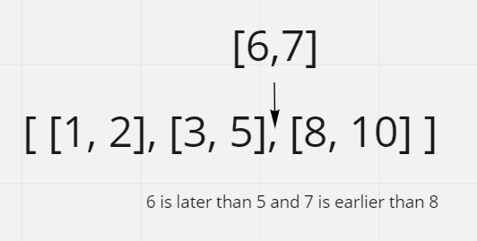
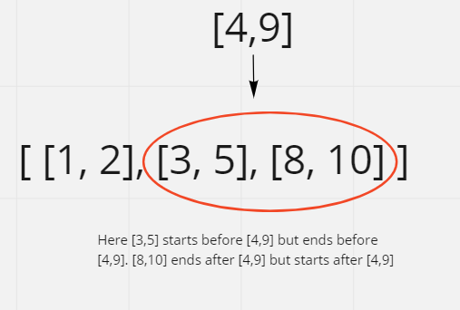
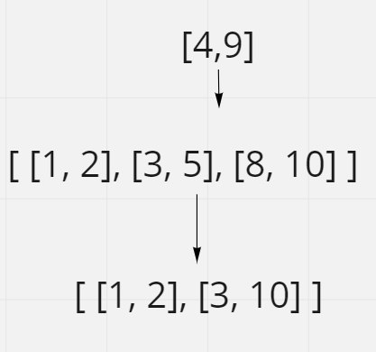

# Insert Interval

## Difficulty


## Problem

Given a set of non-overlapping intervals, insert a new interval into the intervals (merge if necessary).

You may assume that the intervals were initially sorted according to their start times.

### Example 1

```
Input: intervals = [[1,3],[6,9]], newInterval = [2,5]
Output: [[1,5],[6,9]]
```

### Example 2

```
Input: intervals = [[1,2],[3,5],[6,7],[8,10],[12,16]], newInterval = [4,8]
Output: [[1,2],[3,10],[12,16]]
Explanation: Because the new interval [4,8] overlaps with [3,5],[6,7],[8,10].
```

### Example 3

```
Input: intervals = [], newInterval = [5,7]
Output: [[5,7]]
```

### Example 4

```
Input: intervals = [[1,5]], newInterval = [2,3]
Output: [[1,5]]
```

### Example 5

```
Input: intervals = [[1,5]], newInterval = [2,7]
Output: [[1,7]]
```

### Constraints

`0 <= intervals.length <= 104`

`intervals[i].length == 2`

`0 <= intervals[i][0] <= intervals[i][1] <= 105`

`intervals is sorted by intervals[i][0] in ascending order.`

`newInterval.length == 2`

`0 <= newInterval[0] <= newInterval[1] <= 105`

<details>
  <summary>Solutions (Click to expand)</summary>

### Explanation

#### Reconstruct list and merge intervals

Here we will be reconstructing the list of intervals by pushing them into the list as well as with the new interval. To insert the new interval we'll first need to find an appropriate spot to put it in. This new interval can de placed:

1. Right after the last interval where the ending time is earlier than the new interval's starting time
2. Right before the first interval where the starting time is later the new interval's ending time



In some cases this is sufficient but most of the time there will be intervals that will need to be merged together. This happens in the case where:

1. An interval starts before the new interval starts but ends **before** the new interval ends
2. An interval ends after the new interval ends but starts **before** the new interval ends
3. An interval starts after the new interval starts and ends before the new interval ends



If we can merge two intervals together we'll

1. Modify the starting time of the new interval to the earlier of the two
2. Modify the ending time of the new interval to the later of the two



Since there is only one interval to insert we can add the remaining intervals in the list.

Time: `O(N)` Where `N` is the length of `intervals`

Space: `O(N)`

- [JavaScript](./insert-interval.js)
- [TypeScript](./insert-interval.ts)
- [Java](./insert-interval.java)
- [Go](./insert-interval.go)

</details>
