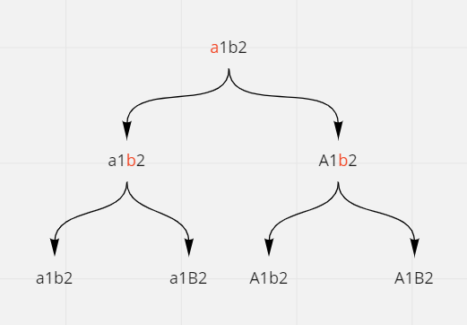

# Letter Case Permutation

## Difficulty


## Problem

Given a string S, we can transform every letter individually to be lowercase or uppercase to create another string.

Return a list of all possible strings we could create. You can return the output in any order.

### Example 1

```
Input: S = "a1b2"
Output: ["a1b2","a1B2","A1b2","A1B2"]
```

### Example 2

```
Input: S = "3z4"
Output: ["3z4","3Z4"]
```

### Example 3

```
Input: S = "12345"
Output: ["12345"]
```

### Example 4

```
Input: S = "0"
Output: ["0"]
```

### Constraints

`S will be a string with length between 1 and 12.`

`S will consist only of letters or digits.`

<details>
  <summary>Solutions (Click to expand)</summary>

### Explanation

#### Backtracking

If we visualize the possible combinations we can make out of a given string we can come up with a decision tree.



For every letter we come across, we can have two possible combinations, one string where the current letter is uppercase and one where the current letter is lowercase. This means we can have in total `2^M` total string combinations where `M` is the total number of letters in the string. We can use a DFS traversal or in this case backtracking to help us build the string every possible combination of uppercase and lowercase letter.

Here we used a `StringBuilder` or a character array to build the string as we traverse all the possible combinations. Once we reach the end of the string we copy the current combination to results List and backtrack to the last seen letter where we build other combinations with uppercase and lowercase letters.

Time: `O(2^M)` Where `M` is the number of letters in the string

Space: `O(2^M * N)` Where `N` is the length of the string.

- [JavaScript](./letter-case-permutation.js)
- [TypeScript](./letter-case-permutation.ts)
- [Java](./letter-case-permutation.java)
- [Go](./letter-case-permutation.go)

</details>
