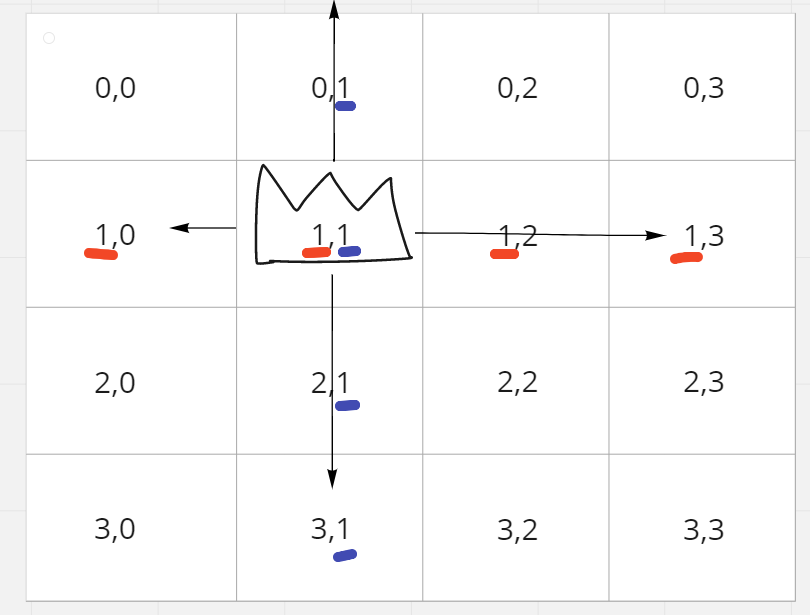
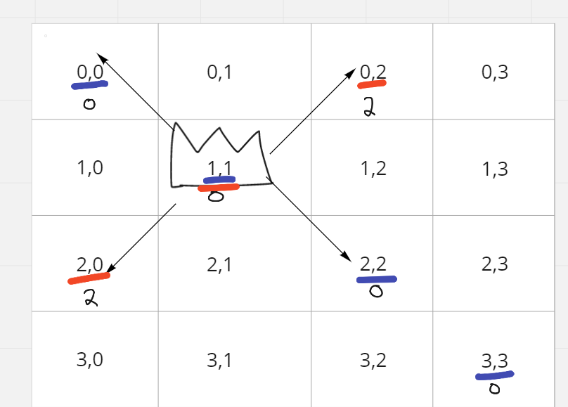
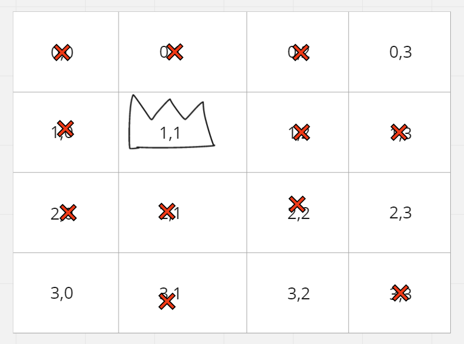

# N-Queens

## Difficulty


## Problem

The n-queens puzzle is the problem of placing n queens on an n x n chessboard such that no two queens attack each other.

Given an integer n, return all distinct solutions to the n-queens puzzle.

Each solution contains a distinct board configuration of the n-queens' placement, where 'Q' and '.' both indicate a queen and an empty space, respectively.

### Example 1


```
Input: n = 4
Output: [[".Q..","...Q","Q...","..Q."],["..Q.","Q...","...Q",".Q.."]]
Explanation: There exist two distinct solutions to the 4-queens puzzle as shown above
```

### Example 2

```
Input: n = 1
Output: [["Q"]]
```

### Constraints

`1 <= n <= 9`

<details>
  <summary>Solutions (Click to expand)</summary>

### Explanation

#### Backtracking

Instead of trying every single grid possibility, we can use backtracking to help us build a valid grid possibilities.

If we know how the Queen move on a chess board we know there are 8 directions that a queen can take to overtake another piece, this includes:

1. `left`
2. `right`
3. `down`
4. `up`
5. `up-right`
6. `up-left`
7. `down-left`
8. `down-right`

We can reduce this down to

1. `horizontal`
2. `vertical`
3. `primary diagonal \`
4. `secondary diagonal /`

If we add coordinates (in the form of `i` and `j`) to a board, we can see the Queen can overtake any piece that has the same `i` or the same `j` as the Queen.



Similarly for diagonal paths we can see that pieces that have the same difference between their coords or the same sum between their coords as the Queen's coords, then the Queen can overtake that piece.



Here all of the spaces in the primary diagonal `\` have the same difference between the coords and all the spaces in the secondary diagonal `/` have the same different between the coords

After taking into account the space the Queen can overtake we are left with the resulting board that show where we can place all the remaining Queens



Our goal is to build boards that have `n` Queens where all Queens are safe from takeover. In terms of a grid this mean that no two queens can be:

1. Part of the same row
2. Part of the same column
3. Part of the same primary diagonal
4. Part of the same secondary diagonal

If we are build a board from top to bottom, then we only need to make sure that we are placing a new piece on every new row. This automatically satisfies that first condition. We then have to if there is a piece in the same column. Since we are building from top to bottom, we only need to check if that are pieces in the same column in the rows above. Lastly, we need to check the diagonals. Again since were building the board from top to bottom we only need to check the board from the current row up.

If we get a board where all `n` queens are placed, we will copy the current state of the board into a `res` list backtrack to the very last piece that we can move and try different spaces.

Time: `O(N!)` Where `N` is the number of queens

Space: `O(N*N)` A grid of `N*N` spaces to build boards

- [JavaScript](./n-queens.js)
- [TypeScript](./n-queens.ts)
- [Java](./n-queens.java)
- [Go](./n-queens.go)

</details>
