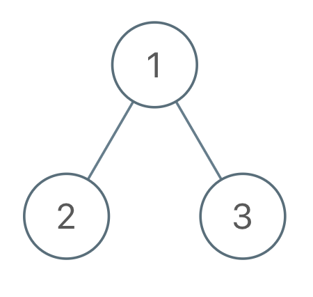

# Flip Binary Tree To Match Preorder Traversal

## Difficulty


## Problem

You are given the root of a binary tree with n nodes, where each node is uniquely assigned a value from 1 to n. You are also given a sequence of n values voyage, which is the desired pre-order traversal of the binary tree.

Any node in the binary tree can be flipped by swapping its left and right subtrees. For example, flipping node 1 will have the following effect:


Flip the smallest number of nodes so that the pre-order traversal of the tree matches voyage.

Return a list of the values of all flipped nodes. You may return the answer in any order. If it is impossible to flip the nodes in the tree to make the pre-order traversal match voyage, return the list [-1].

### Example 1


```
Input: root = [1,2], voyage = [2,1]
Output: [-1]
Explanation: It is impossible to flip the nodes such that the pre-order traversal matches voyage.
```

### Example 2



```
Input: root = [1,2,3], voyage = [1,3,2]
Output: [1]
Explanation: Flipping node 1 swaps nodes 2 and 3, so the pre-order traversal matches voyage.
```

### Example 3


```
Input: root = [1,2,3], voyage = [1,2,3]
Output: []
Explanation: The tree's pre-order traversal already matches voyage, so no nodes need to be flipped.
```

### Constraints

`The number of nodes in the tree is n.`

`n == voyage.length`

`1 <= n <= 100`

`1 <= Node.val, voyage[i] <= n`

`All the values in the tree are unique.`

`All the values in voyage are unique.`

<details>
  <summary>Solutions (Click to expand)</summary>

### Explanation

#### Solution

##### Intuition

If we perform a pre-order traversal on the tree and the order of node values we visitied matches the order of `voyages` then we know that the tree matches the desired pre-order traversal.

In the case that the current node value does not match the next value in voyage, we have a couple options:

1. If we are in the left subtree we can traverse backwards to the parent node and _**flip**_ the tree.

2. If we are in the right subtree, we have no other subtree to traverse and the pre-order traversal is impossible

Instead physically changing the tree, we can simply change our traversal path. If we can perform a peek on the left subtree node and the value matches the next value in `voyages`, then we can safely traverse to the left subtree. If the values do not match, we can traverse to the right subtree first.

##### Implementation

We will perform a pre-order `root-left-right` traversal on the tree. Upon visiting the nodes we will check if the current node matches the current value in `voyages` if it does we will move to the next value in `voyages`. If it doesn't the pre-order traversal is impossible and we can return `-1` immediately.

To deciede whether to traverse to the left or right subtree next, we will peek at the left subtree node. If it matches the next value in `voyages` we will traverse to that node. If it doesn't we need to perform a _**flip**_ and traverse to the right subtree node. In doing so we need to push the current node into our answer list.


Time: `O(N)` Where `N` is the size of the tree

Space: `O(N)`

- [JavaScript](./flip-binary-tree-to-match-preorder-traversal.js)
- [TypeScript](./flip-binary-tree-to-match-preorder-traversal.ts)
- [Java](./flip-binary-tree-to-match-preorder-traversal.java)
- [Go](./flip-binary-tree-to-match-preorder-traversal.go)

</details>
