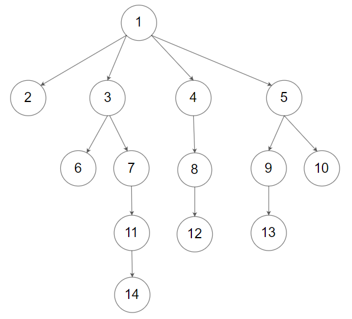
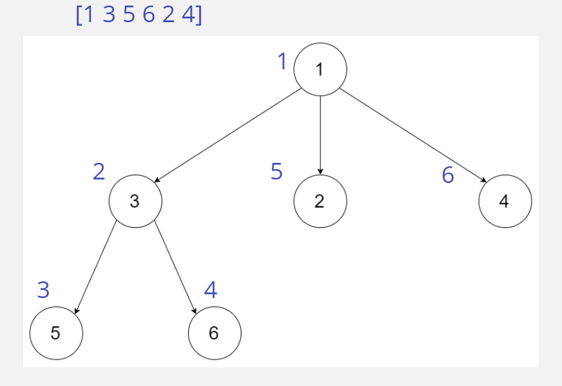

# N-ary Tree Preorder Traversal

## Difficulty


## Problem

Given the root of an n-ary tree, return the preorder traversal of its nodes' values.

Nary-Tree input serialization is represented in their level order traversal. Each group of children is separated by the null value (See examples)

### Example 1


```
Input: root = [1,null,3,2,4,null,5,6]
Output: [1,3,5,6,2,4]
```

### Example 2



```
Input: root = [1,null,2,3,4,5,null,null,6,7,null,8,null,9,10,null,null,11,null,12,null,13,null,null,14]
Output: [1,2,3,6,7,11,14,4,8,12,5,9,13,10]
```

### Constraints

`The number of nodes in the tree is in the range [0, 104].`

`0 <= Node.val <= 104`

`The height of the n-ary tree is less than or equal to 1000.`

<details>
  <summary>Solutions (Click to expand)</summary>

### Explanation

#### Solution

##### Intuition

A Preorder traversal of a Binary Tree involves traversing the tree in a root, left child, right child order. We can apply this to an N-ary tree by traversing the root and all its children in order from left to right.

##### Implementation

We will do a normal DFS traversal of the tree where every node we visit will first get inserted into a list. All of the children in the `List<Node>` will be traversed from left to right.



- [JavaScript](./n-ary-tree-preorder-traversal.js)
- [TypeScript](./n-ary-tree-preorder-traversal.ts)
- [Java](./n-ary-tree-preorder-traversal.java)
- [Go](./n-ary-tree-preorder-traversal.go)

</details>
