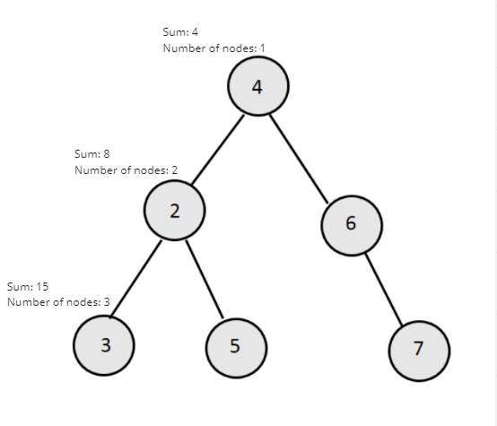

# Average of Levels in Binary Tree

## Difficulty


## Problem

Given a non-empty binary tree, return the average value of the nodes on each level in the form of an array.

### Example 1

```
Input:
    3
   / \
  9  20
    /  \
   15   7
Output: [3, 14.5, 11]
Explanation:
The average value of nodes on level 0 is 3,  on level 1 is 14.5, and on level 2 is 11. Hence return [3, 14.5, 11].
```

### Constraints

`The range of node's value is in the range of 32-bit signed integer.`

<details>
  <summary>Solutions (Click to expand)</summary>

### Explanation

#### BFS

Our strategy is to visit all of the node for each level in order. At each level we will keep track of the sum of the nodes' values and the number of nodes at each level. After visiting all of the nodes for a level we will calculate the average by using `sumOfNodeValues / numberOfNodes` and push it in to the list.

To visit in nodes in order we can use a queue that we'll use to push the children of nodes into. Once we finish visiting all the nodes of a level, the size of the queue will be the number of nodes at the next level. We will keep track of this to make sure we calculate the correct sums and averages for each level.



Time: `O(N)` Where `N` is the number of nodes in the tree

Space: `O(M)` Where `M` is the maximum number of nodes at any level

- [JavaScript](./average-of-levels-in-binary-tree.js)
- [TypeScript](./average-of-levels-in-binary-tree.ts)
- [Java](./average-of-levels-in-binary-tree.java)
- [Go](./average-of-levels-in-binary-tree.go)

</details>
