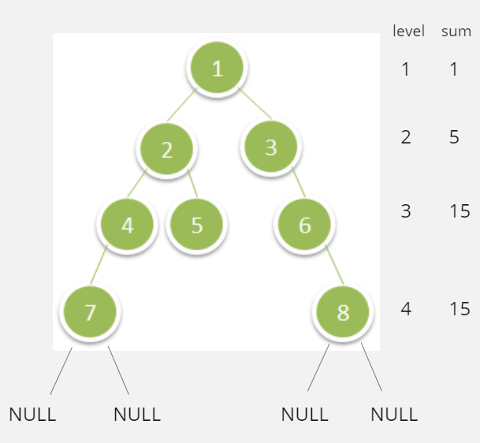

# Deepest Leaves Sum

## Difficulty


## Problem

Given the root of a binary tree, return the sum of values of its deepest leaves.

### Example 1


```
Input: root = [1,2,3,4,5,null,6,7,null,null,null,null,8]
Output: 15
```

### Example 2

```
Input: root = [6,7,8,2,7,1,3,9,null,1,4,null,null,null,5]
Output: 19
```

### Constraints

`The number of nodes in the tree is in the range [1, 104].`

`1 <= Node.val <= 100`

<details>
  <summary>Solutions (Click to expand)</summary>

### Explanation

#### Solution

##### Intuition

If leaf node are node without children, then the deepest leaves are at a level in tree where none of the nodes have children. If we traverse the tree level by level, we can get the sum of the deepest leaves by taking the sum of all the nodes at the last level.



##### Implementation

We will do a BFS level by level order traversal of the tree. For every level we will take the sum of all the nodes and store it in a variable. If the current level contains children nodes we will traverse the next level, take the sum of the nodes, and overwrite the sum stored.

By the end of traversing the entire tree our stored sum will contain the sum of the nodes at the last level or the level at which none of the nodes contain children

Time: `O(N)` Where `N` is the size of the tree

Space: `O(L)` Where `L` is the size of the largest level in the tree

- [JavaScript](./deepest-leaves-sum.js)
- [TypeScript](./deepest-leaves-sum.ts)
- [Java](./deepest-leaves-sum.java)
- [Go](./deepest-leaves-sum.go)

</details>
