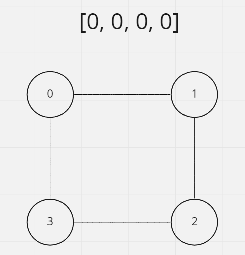
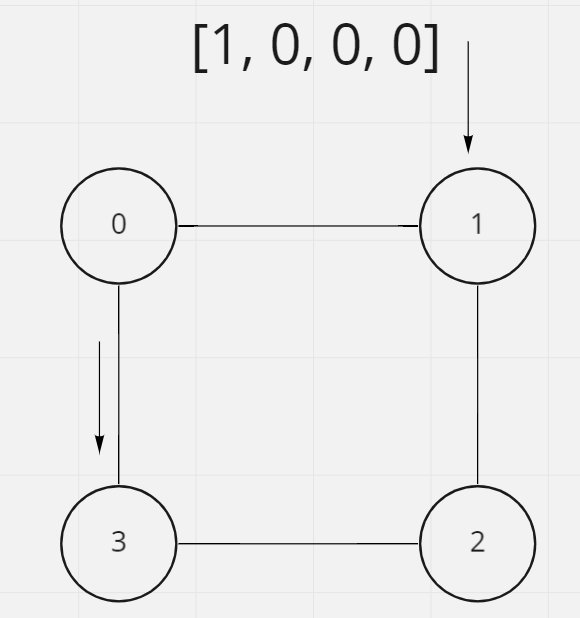
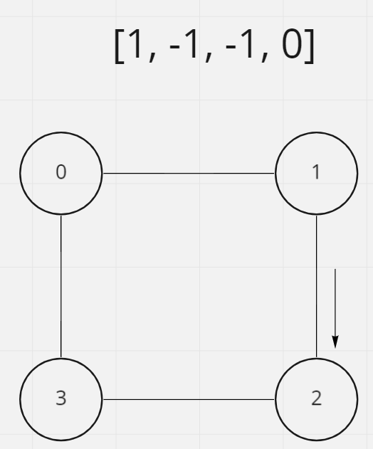
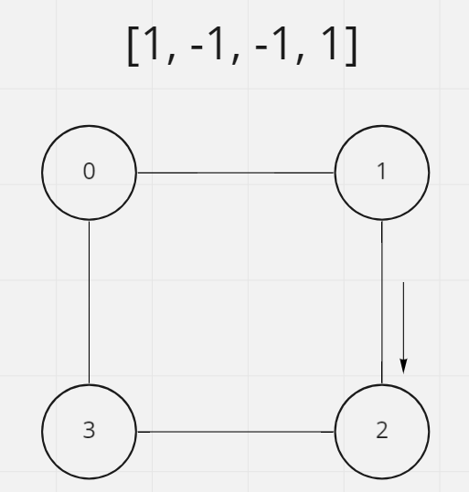

# Is Graph Bipartite

## Difficulty


## Problem

Given an undirected graph, return true if and only if it is bipartite.

Recall that a graph is bipartite if we can split its set of nodes into two independent subsets A and B, such that every edge in the graph has one node in A and another node in B.

The graph is given in the following form: graph[i] is a list of indexes j for which the edge between nodes i and j exists. Each node is an integer between 0 and graph.length - 1. There are no self edges or parallel edges: graph[i] does not contain i, and it doesn't contain any element twice.

### Example 1


```
Input: graph = [[1,3],[0,2],[1,3],[0,2]]
Output: true
Explanation: We can divide the vertices into two groups: {0, 2} and {1, 3}.
```

### Example 2


```
Input: graph = [[1,2,3],[0,2],[0,1,3],[0,2]]
Output: false
Explanation: We cannot find a way to divide the set of nodes into two independent subsets.
```

### Constraints

`1 <= graph.length <= 100`

`0 <= graph[i].length < 100`

`0 <= graph[i][j] <= graph.length - 1`

`graph[i][j] != i`

`All the values of graph[i] are unique.`

`The graph is guaranteed to be undirected.`

<details>
  <summary>Solutions (Click to expand)</summary>

### Explanation

#### BFS Marking Nodes

##### Intuition and Approach

If we were to make every cell with an `1` indicating that it is a part of set `A` or a `-1` indicating that it is a part of group `B`, then a graph can only by Bipartite if adjacent nodes have the do not have the same mark. An easy way to compare adjacent nodes is with a BFS traversal. As long as all of the adjacent nodes of the current node are part of the not part of the same set as the current node, then the graph is Bipartite. If any adjacent node is part of the same set as the current node, then the graph is said to have an edge that connect to node of the same set. The graph is not considered Bipartite.

##### Procedure

Since nodes are given to us in the form of array with indices to adjacent nodes, we'll need extra space to store what set each node is a part of. An array or map would work fine here.



After visiting the first node we will mark it as part of the `1` set and check its adjacent nodes.



If the adjacent nodes are not marked, has a value of `0` in the array, then they have not been visited. Mark the next nodes as part of `-1`, the opposite of the current nodes. Add them to the queue to be visited next.

If the adjacent have been visited and have a value other than `0` in the array, then check if its the same as the current node. If it is then the edge from the current node and the next node are connecting to nodes that are a part of the same set. The graph is not Bipartite.



Follow the same procedure with the next nodes.



Once all the nodes connected node have been visited, repeat the process on other starting nodes to ensure there are no disconnected nodes. We can use the same array to prevent us from having to revisited nodes.

Time: `O(N)` Where `N` is the total number of nodes

Space: `O(N)`

- [JavaScript](./is-graph-bipartite.js)
- [TypeScript](./is-graph-bipartite.ts)
- [Java](./is-graph-bipartite.java)
- [Go](./is-graph-bipartite.go)

</details>
