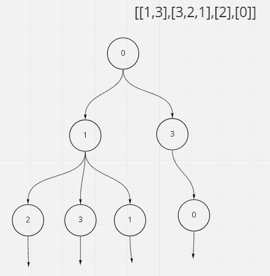
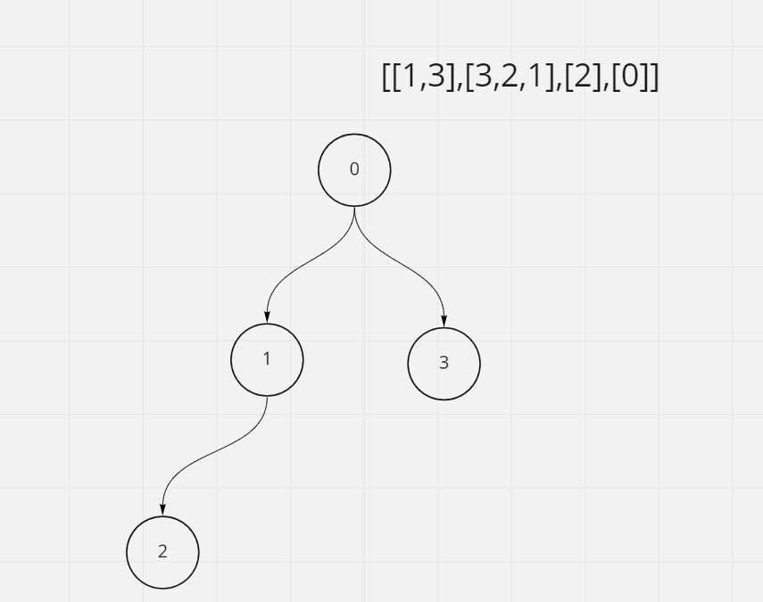

# Keys and Rooms

## Difficulty


## Problem

There are N rooms and you start in room 0. Each room has a distinct number in 0, 1, 2, ..., N-1, and each room may have some keys to access the next room.

Formally, each room i has a list of keys rooms[i], and each key rooms[i][j] is an integer in [0, 1, ..., N-1] where N = rooms.length. A key rooms[i][j] = v opens the room with number v.

Initially, all the rooms start locked (except for room 0).

You can walk back and forth between rooms freely.

Return true if and only if you can enter every room.

### Example 1

```
Input: [[1],[2],[3],[]]
Output: true
Explanation:
We start in room 0, and pick up key 1.
We then go to room 1, and pick up key 2.
We then go to room 2, and pick up key 3.
We then go to room 3.  Since we were able to go to every room, we return true.
```

### Example 2

```
Input: [[1,3],[3,0,1],[2],[0]]
Output: false
Explanation: We can't enter the room with number 2.
```

### Constraints

`1 <= rooms.length <= 1000`

`0 <= rooms[i].length <= 1000`

`The number of keys in all rooms combined is at most 3000.`

<details>
  <summary>Solutions (Click to expand)</summary>

### Explanation

#### BFS

For every key we find in `rooms[0]` we'll want to visit those rooms next. For the all the keys we collect from the rooms we visited we'll want to visited next. If we think of it as levels we can see that at level `0` we visited room `0` since its the only room open. At ;eve; `1` we'll visit all the rooms that are contained at `rooms[0]`. At level `2` we'll visit all of the room at are contained in the rooms contained in `room[0]`



For most lists this would end up being a never ending tree since some rooms contain keys to rooms we've alread visited. To prevent this we'll keep track of the rooms we visited and for every key we get we'll check if we've alread visited. If we have we don't need to visit it. If we haven't we will visit it



Time: `O(N + K)` Where `N` is the length of `rooms` and `K` is the total numbers of keys

Space: `O(N)`

- [JavaScript](./keys-and-rooms.js)
- [TypeScript](./keys-and-rooms.ts)
- [Java](./keys-and-rooms.java)
- [Go](./keys-and-rooms.go)

</details>
