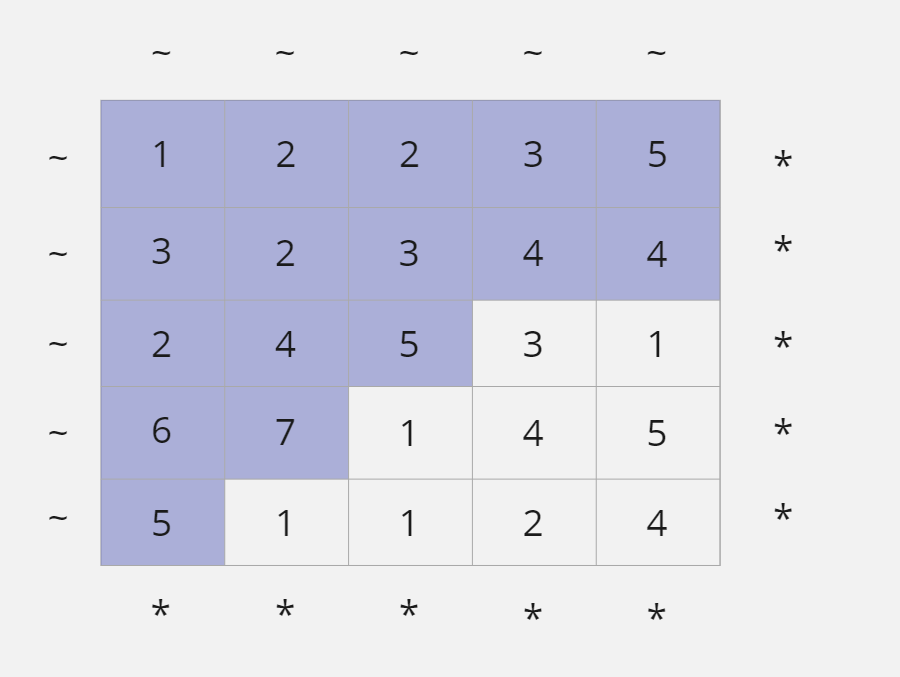
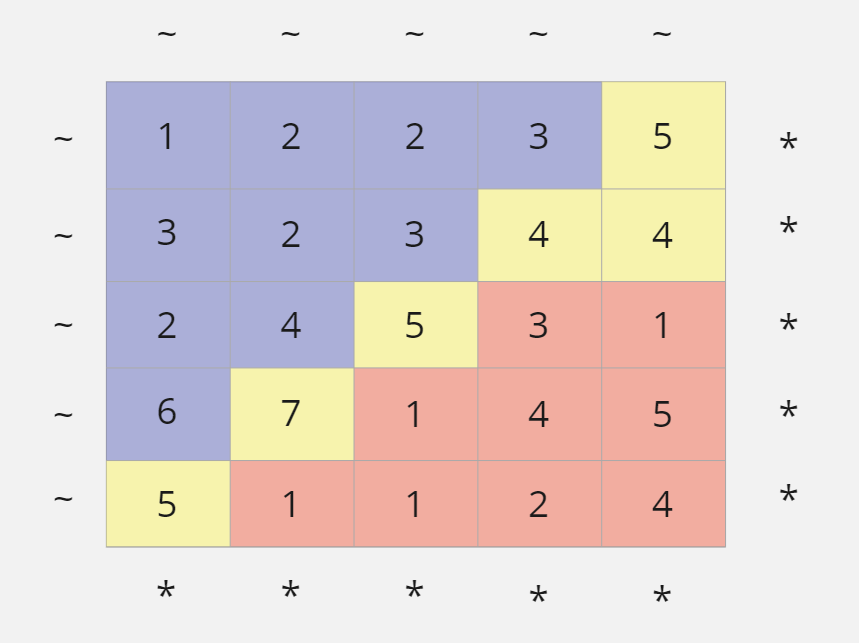

# Pacific Atlantic Water Flow

## Difficulty


## Problem

Given an m x n matrix of non-negative integers representing the height of each unit cell in a continent, the "Pacific ocean" touches the left and top edges of the matrix and the "Atlantic ocean" touches the right and bottom edges.

Water can only flow in four directions (up, down, left, or right) from a cell to another one with height equal or lower.

Find the list of grid coordinates where water can flow to both the Pacific and Atlantic ocean.

Note:

1. The order of returned grid coordinates does not matter.
2. Both m and n are less than 150.

### Example 1

```
Given the following 5x5 matrix:

  Pacific ~   ~   ~   ~   ~
       ~  1   2   2   3  (5) *
       ~  3   2   3  (4) (4) *
       ~  2   4  (5)  3   1  *
       ~ (6) (7)  1   4   5  *
       ~ (5)  1   1   2   4  *
          *   *   *   *   * Atlantic

Return:

[[0, 4], [1, 3], [1, 4], [2, 2], [3, 0], [3, 1], [4, 0]] (positions with parentheses in above matrix).
```

### Constraints

<details>
  <summary>Solutions (Click to expand)</summary>

### Explanation

#### BFS

##### Intuition

If our target is for water to flow to one of the edges of the matrix, we can work backwards from the edges of the matrix to see from how many cells water flow from to reach the edges of the matrix.

For water to flow to a cell the cell must be of an lower or equal height of that of the water containing the water or `matrix[i][j] <= matrix[a][b]` where `i` and `j` are the coordinates of the cell that water can flow to. Likewise, for water to flow from a cell the cell containing the water must be a greater height than the cell that water is flowing to or `matrix[a][b] > matrix[i][j]` where `a` and `b` are the coordinates of the cell that contains the water.

If we were to start from the edges of the matrix and traverse the matrix using the rule for where water from flow from then we can find all the cells of the matrix in the cells that water can flow to the edges of the matrix. If we were to keep track of the of what cells can flow water to the Pacific and the Atlanic we can take cells that are in common as the cells where water can flow to the Pacific and Atlantic

##### Implementation

To keep track of what cells can flow water to the Pacific and Atlanic we will keep track of two matricies of the same size of `matrix`. For the two matricies `pacificGrid` and `atlanicGrid`, `pacificGrid[i][j]` will indicate whether water from the `matrix[i][j]` cell can flow to the pacific and `atlanicGrid[i][j]` will indicate whether water from the `matrix[i][j]` cell can flow to the atlantic.

To fill our grid we will start BFS traversals from all of the left edge and top edge cells for the Pacific and right edge and bottom edge cells for the atlantic. For every cell we visit, we can mark it as visited in the corresponding grid. For every left, right, top and bottom neighboring cell that is inbounds and greater than the current cell we can traverse to next. If the cell we can visit next has already been visited in the current ocean grid then we do not need to visit it again.

We will start BFS searches from the top and left edge cells to find the cells from where water can flow to the Pacific



We will then start BFS seaches from the bottom and right edge cells to find the cells from where water can flow to the Atlantic



Once both `pacificGrid` and `atlanicGrid` have been filled with cells visited, the cells they have in common are the cells where water can flow to the Atlanic and the Pacific

Time: `O(N * M)` Where `N` and `M` are the height and width of `matrix`

Space: `O(N * M)`

- [JavaScript](./pacific-atlantic-water-flow.js)
- [TypeScript](./pacific-atlantic-water-flow.ts)
- [Java](./pacific-atlantic-water-flow.java)
- [Go](./pacific-atlantic-water-flow.go)

</details>
