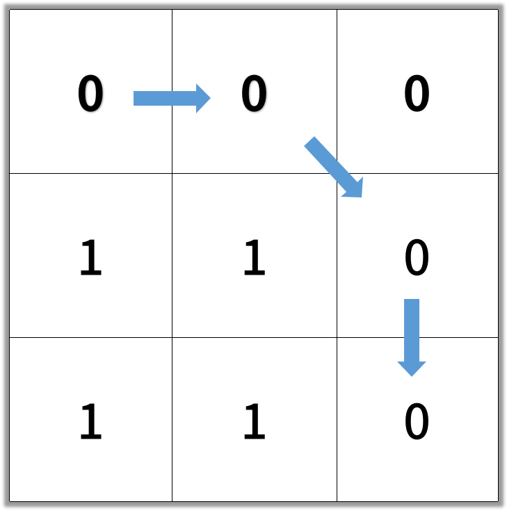

# Shortest Path in Binary Matrix

## Difficulty


## Problem

In an N by N square grid, each cell is either empty (0) or blocked (1).

A clear path from top-left to bottom-right has length k if and only if it is composed of cells C_1, C_2, ..., C_k such that:

Adjacent cells C*i and C*{i+1} are connected 8-directionally (ie., they are different and share an edge or corner)
C_1 is at location (0, 0) (ie. has value grid[0][0])
C_k is at location (N-1, N-1) (ie. has value grid[N-1][n-1])
If C_i is located at (r, c), then grid[r][c] is empty (ie. grid[r][c] == 0).
Return the length of the shortest such clear path from top-left to bottom-right. If such a path does not exist, return -1.

### Example 1

```
Input: [[0,1],[1,0]]
```


```
Output: 2
```


### Example 2

```
Input: [[0,0,0],[1,1,0],[1,1,0]]
```


```
Output: 4
```



### Constraints

`1 <= grid.length == grid[0].length <= 100`

`grid[r][c] is 0 or 1`

<details>
  <summary>Solutions (Click to expand)</summary>

### Explanation

#### Breadth First Search

Since none of the paths are weighted, we can use a simple breath first search to get to the destination cell using the 8 predefined directions we can traverse to another cell. Conveniently, the grid is already marked with cells that we can't visit as denoted by `1`. Once we visit a cell that was once open, we can close it by flipping it to `1` to denote that it has already been visited. This prevents us from having to create extra space to record previously visited cells.

If the starting cells or the ending cell is closed, we can immediately return `-1`

Time: `O(N)`
Space: `O(N)` Space for queue

- [JavaScript](./shortest-path-in-binary-matrix.js)
- [TypeScript](./shortest-path-in-binary-matrix.ts)
- [Java](./shortest-path-in-binary-matrix.java)
- [Go](./shortest-path-in-binary-matrix.go)

</details>
