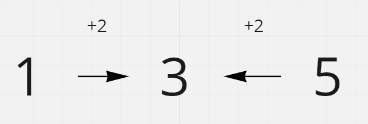
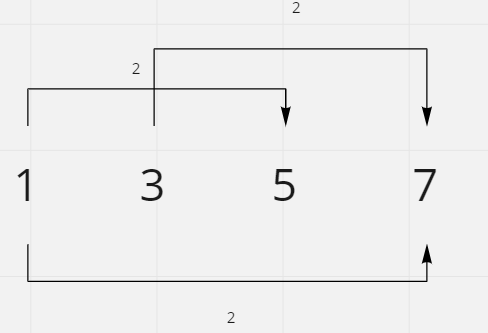
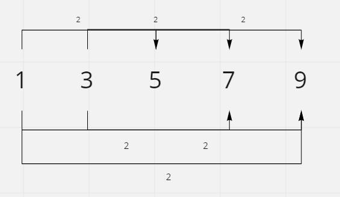

# Arithmetic Slices

## Difficulty


## Problem

A sequence of numbers is called arithmetic if it consists of at least three elements and if the difference between any two consecutive elements is the same.

For example, these are arithmetic sequences:

```
1, 3, 5, 7, 9
7, 7, 7, 7
3, -1, -5, -9
The following sequence is not arithmetic.
```

```
1, 1, 2, 5, 7
```

A zero-indexed array A consisting of N numbers is given. A slice of that array is any pair of integers (P, Q) such that 0 <= P < Q < N.

A slice (P, Q) of the array A is called arithmetic if the sequence:
A[P], A[P + 1], ..., A[Q - 1], A[Q] is arithmetic. In particular, this means that P + 1 < Q.

The function should return the number of arithmetic slices in the array A.

### Example 1

```
A = [1, 2, 3, 4]

return: 3, for 3 arithmetic slices in A: [1, 2, 3], [2, 3, 4] and [1, 2, 3, 4] itself.
```

### Constraints

<details>
  <summary>Solutions (Click to expand)</summary>

### Explanation

#### Dynamic Programming

Since arithmetic slices have to be at minimum a length of `3`, we'll use a sliding window to traverse the array in segments. In order for a subarray to be _arithmetic_, every consecutive number needs to have the same difference. Since our window is of length `3`, we can check this by comparing the different between the middle number and the left and right numbers.



If we only do this we'll simply get all of the arithmetic slices that are of length `3` but since these slices can be greater than `3` numbers, we'll need a way to check slices for greater length. One methods involves traversing the array again but with a window of length `4`, `5` and so on. This works but if we know that two arithmetic slices overlap each other then we can assume that we can merge the two into one larger one.

For example, if we know that the all three numbers in the first slice, consisting of `A[0], A[1], A[2]` have difference of `2` then we know that the next window, consisting of `A[1], A[2], A[3]`, also needs to have a difference of `2` because this window shares two of the same elements as the first one (`A[1], A[2]`). This would mean that the difference between `A[2]` and `A[3]` would need to be the same as `A[1]` and `A[2]`. If this is true then, we can say that the difference between `A[0]` and `A[1]` is the same as `A[2]` and `A[3]`. Since the different between all number in subarray `A[0], A[1], A[2], A[3]` all have the same difference we can count this subarray as an arithmetic slice of length `4`.



So instead of counting the new subarray as one additional slice, we would count it as `2` additional subarrays.

The same can be done for a slice of `5` numbers. If `A[2], A[3], A[4]` all have the same difference then we can say that `A[0], A[1], A[2], A[3], A[4]` is considered a slice. If we break it down into smaller slices we can find, `A[0], A[1], A[2]`, `A[1], A[2], A[3]`, `A[2], A[3], A[4]`, `A[0], A[1], A[2], A[3]`, `A[1], A[2], A[3], A[4]`. This counts as a total of `6` different slices making it an additional `3` subarrays.



This means for every arithmetic slice we find, we can add `1 + the number of previous consecutive arithmetic slices` to the total sum of arithmetic slices in the array

Time: `O(N)` Where `N` is the length the array

Space: `O(1)`

- [JavaScript](./arithmetic-slices.js)
- [TypeScript](./arithmetic-slices.ts)
- [Java](./arithmetic-slices.java)
- [Go](./arithmetic-slices.go)

</details>
