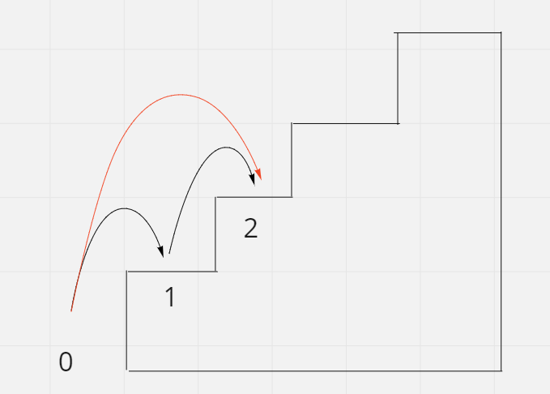

# Climbing Stairs

## Difficulty


## Problem

You are climbing a staircase. It takes n steps to reach the top.

Each time you can either climb 1 or 2 steps. In how many distinct ways can you climb to the top?

### Example 1

```
Input: n = 2
Output: 2
Explanation: There are two ways to climb to the top.
1. 1 step + 1 step
2. 2 steps
```

### Example 2

```
Input: n = 3
Output: 3
Explanation: There are three ways to climb to the top.
1. 1 step + 1 step + 1 step
2. 1 step + 2 steps
3. 2 steps + 1 step
```

### Constraints

`1 <= n <= 45`

<details>
  <summary>Solutions (Click to expand)</summary>

### Explanation

#### Bottom Up Dynamic Programming

We can see that this problem can be broken down into sub problems. If we want to all possible way to jump to the top we have to know all possible ways to jump to the stair one before and two before first. And if we want to to know that we'll need to to the same process over and over again until we reach the first stair where it know its our starting point

Starting from the bottom, we know that possible paths to get to the first and second stairs. We can get to the first stair by jumping one from the _0th_ stair and we can get to the second stair by jumping 2 from the _0th_ stair and jumping 1 from _0th_ stair plus jumping 1 from the _1st_ stair

We can get to the third step by one of two ways:

1. Jumping 1 from the _2nd_ step
2. Jumping 2 from the _1st_ step

To calculate the total unique paths we can take to the _3rd_ step we need to know unique paths to get to the _2nd_ and _1st_ step. We can use an array, `steps`,indexed `0..n` that represents the total possible paths to every step. Once we figure that out, we know that all possible paths to get to the _3rd_ step are

1. jump 1, jump 1, jump 1
2. jump 2, jump 1
3. jump 1, jump 2



To simplify this as a formula, we can say that the total unique paths to get to the _ith_ step by using `steps[i] = steps[i - 1] + steps[i - 2]`

Time: `O(N)` Where `N` is `n`

Space: `O(N + 1)`

#### Fibonacci Approach

As explained in the previous solution we can find the total unique paths to a step by getting the sum of total paths the to the previous two steps. This closely resembles a fibonacci where the _ith_ number is the sum of the _i-1th_ and _i-2th_ number. In fact the formula we made up previously is almost identical `steps[i] = steps[i - 1] + steps[i - 2]`. Use dynamic programming but using `O(1)` space.

Time: `O(N)` Where `N` is `n`

Space: `O(1)`

- [JavaScript](./climbing-stairs.js)
- [TypeScript](./climbing-stairs.ts)
- [Java](./climbing-stairs.java)
- [Go](./climbing-stairs.go)

</details>
