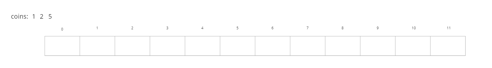
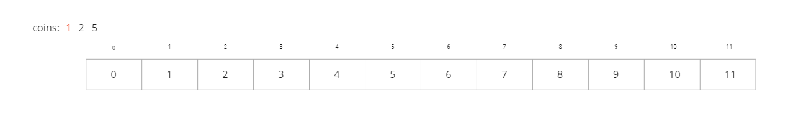
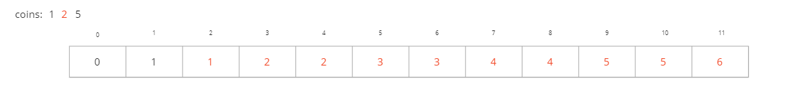
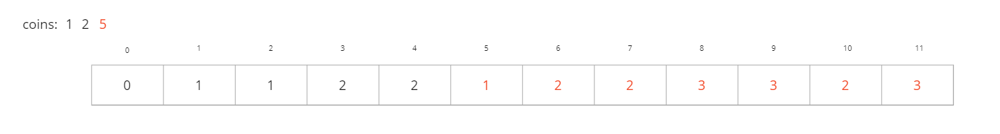

# Coin Change

## Difficulty


## Problem

You are given coins of different denominations and a total amount of money amount. Write a function to compute the fewest number of coins that you need to make up that amount. If that amount of money cannot be made up by any combination of the coins, return -1.

You may assume that you have an infinite number of each kind of coin.

### Example 1

```
Input: coins = [1,2,5], amount = 11
Output: 3
Explanation: 11 = 5 + 5 + 1
```

### Example 2

```
Input: coins = [2], amount = 3
Output: -1
```

### Example 3

```
Input: coins = [1], amount = 0
Output: 0
```

### Example 4

```
Input: coins = [1], amount = 1
Output: 1
```

### Example 5

```
Input: coins = [1], amount = 2
Output: 2
```

### Constraints

`1 <= coins.length <= 12`

`1 <= coins[i] <= 231 - 1`

`0 <= amount <= 104`

<details>
  <summary>Solutions (Click to expand)</summary>

### Explanation

#### Dynamic Programming

##### Intuition

An intuitive solution would be to generate possible combinations using the greatest valued coins. Generating and validating these combinations can be costly since the majority of combinations wont exactly equal the `amount`.

We can also do this using the tedious way of starting from `0` and incrementally increase the amount using the most efficient combination possible. For example you need to have change for an amount of `15` and your have coins that represent values of `1,5,10` we can start by building the most efficient combination for `0`. For `0` we can represent that using `0` coins or `[]`. For the next number `1` we can best represent that using `1` coin combination `[1]`. For the next number `2` we can represent that with `2` numbers `[1 1]`. Fast forward to `5` and we have two possible combinations. We can represent `5` as `[1 1 1 1 1]` or as `[5]` we will use the latter since its the most efficient. Finally for `15`, `[10 5]` is the best combination.

We know how to get the most efficient combination for any greater amount because we know the most efficient combinations for all smaller amounts. Whenever we came the amount of `5` we knew that we can either add `1` to most efficient combination for an amount of `4` or add `5` to most efficient combination of `0` because `4 + 1 = 5` and `0 + 5 = 5`. When we get to the amount of `15` we knew we can either add `1` to the most efficient combination of `14`, add `5` to the most efficient combination of `10`, or add `10` to the most efficient combination of `5` because `14 + 1 = 15`, `10 + 5 = 15`, and `5 + 10 = 15`. We can represent this logic as `coinChange(coins, 15) = min(coinChange(coins, 15 - 1) + 1, coinChange(coins, 15 - 5) + 1, coinChange(coins, 15 - 10) + 1)`. By doing this we are breaking down the problem into smaller subproblems.

##### Implementation

The intution for solving this problem most resembles a `bottom-up` dynamic programming approach where we solve smaller subproblems to find the result of greater subproblems. Our subproblems are find the most efficient combinations for `0... mount - 1` using the given coins. For this we'll need an array of size `amount + 1` to represent the amounts of `0...amount`. At `dp[i]` will be the smallest number of coins we can use to represent `i`. We'll initially mark the position with `Integer.MAX_VALUE - 1` (-1 to prevent int overflow)


Since we know the combination for `0`, we'll fill that in first.

Using the first coin, we'll go through the array to find the most efficient combinations for `i` and place it at `dp[i]`. We can find it by taking the most efficient combination of `dp[i - coin]` and adding `1`. If the calculation if smaller than the one at `dp[i]` we'll update the value.




Using the next coin, we'll go through the array again to find the most efficient combinations for `i` by using `dp[i] = min(dp[i], dp[i - coin] + 1)`



We'll do the same for the rest of the coins



By the end we'll have the most efficient combination for `amount` at `dp[amount]`

Time: `O(C * A)` Where `C` is the length of `coins` and `A` is amount

Space: `O(A)`

- [JavaScript](./coin-change.js)
- [TypeScript](./coin-change.ts)
- [Java](./coin-change.java)
- [Go](./coin-change.go)

</details>
