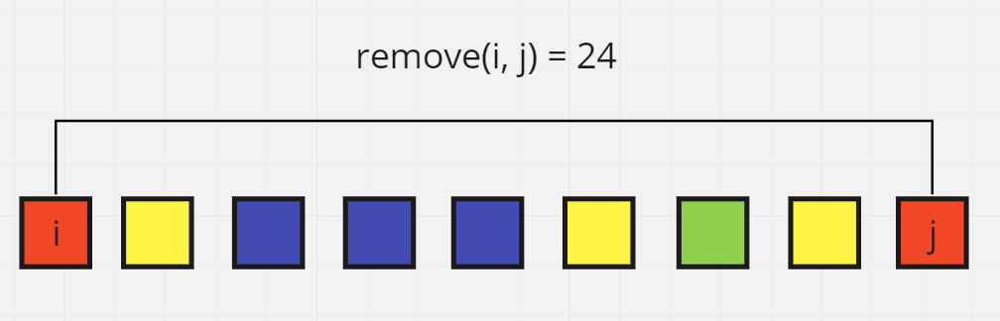
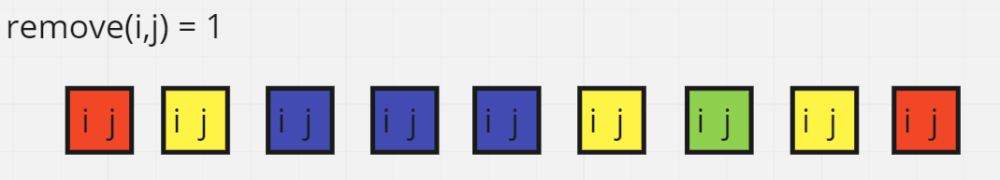
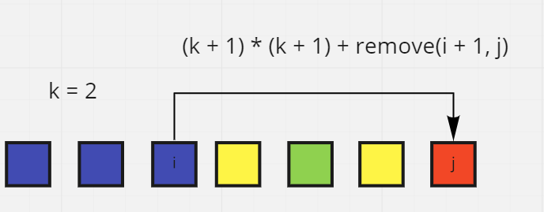
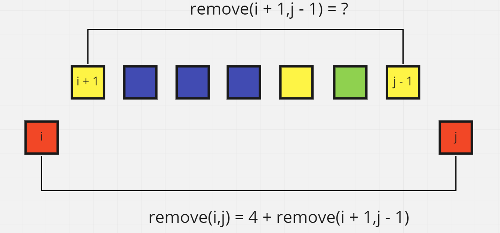
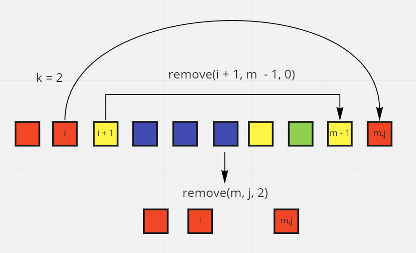
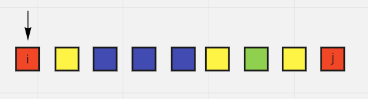
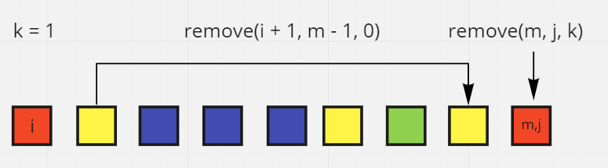

# Remove Boxes

## Difficulty


## Problem

You are given several boxes with different colors represented by different positive numbers.

You may experience several rounds to remove boxes until there is no box left. Each time you can choose some continuous boxes with the same color (i.e., composed of k boxes, k >= 1), remove them and get k \* k points.

Return _the maximum points you can get_.

### Example 1

```
Input: boxes = [1,3,2,2,2,3,4,3,1]
Output: 23
Explanation:
[1, 3, 2, 2, 2, 3, 4, 3, 1]
----> [1, 3, 3, 4, 3, 1] (3*3=9 points)
----> [1, 3, 3, 3, 1] (1*1=1 points)
----> [1, 1] (3*3=9 points)
----> [] (2*2=4 points)
```

### Example 2

```
Input: boxes = [1,1,1]
Output: 9
```

### Example 3

```
Input: boxes = [1]
Output: 1
```

### Constraints

`1 <= boxes.length <= 100`

`1 <= boxes[i] <= 100`

<details>
  <summary>Solutions (Click to expand)</summary>

### Explanation

#### Dynamic Programming

_Explanation inspired by [fun4LeetCode's](https://leetcode.com/fun4LeetCode) [solution](https://leetcode.com/problems/remove-boxes/discuss/101310/Java-top-down-and-bottom-up-DP-solutions)_

##### Concepts and Approach

Here we'll define `remove(i, j)` as a recursively called function that calculates the max points we can get from removing boxes from a `boxes` subarray starting at `i` and ending at `j` (inclusive).



The base cases for the function are:

1. `remove(i, j) i < j` the subarray has a length of 0, there are no points to be collected
2. `remove(i,j) i == j` the subarray has a length of 1, there is only one box and and max amount of points we can get from removing it is `1`



This shows that the least number of points we can get is by removing every box individually. But if we remove multiple boxes that border each other either from the left or the right, we can get `k*k` points where `k` is the number of duplicate boxes removed. We can calculate this as `(k + 1) * (k + 1) + remove(i + 1, j)` where `k` is the number of boxes that prefix `i` and are identical to `nums[i]`



However given this information we still wouldn't know what our max points would since removing some boxes may other boxes next to each other leaving us with better opportunities to make more points.

For example if `nums[i]` is of the same color as `nums[j]` but there are `j - i + 1` boxes in between that are not of the same colors then we can say that `remove(i,j)` is `4 + remove(i + 1, j - 1)` where 4 is the result of removing the two boxes of the same color and `remove(i + 1, j - 1)` is the max number of points we can get from removing the boxes in between.



If we want to be able to make the most amount of points from removing `nums[j]`, we need to removing along with `nums[i]` which is the prefix of subarray `i + 1, m - 1` where `m` is the index of the box we want to pair the prefix with. We can't simply notate it as `remove(i,m)` since this would include the boxes in the middle. We would need to introduce another argument that would include the number of duplicate boxes we want to remove would prefix the current box.



Here `k` is the number of boxes that are identical to `nums[m]` that are at `i` and border `i` from the left. Max number of points we can make out of this is `remove(i + 1, m - 1, 0) + remove(m, j, 2)` where `remove(m, j, 2)` would be the max number of points we can make from subarray `m, j` (which is `1`)

Since this approach is prone to overlapping and recalculations of smaller subarrays, we will use a 3D array for memoization where `dp[i][j][k]` stores the previously calculated result of `remove(i, j, k)`

##### Procedure

We'll first start out by calling the `remove` function with `remove(0, nums.length - 1, 0)` to start recursively calculating the max points. As stated before the base cases for this function are:

1. `i < j` return `0`
2. `i == j` return `(k + 1) * (k + 1)`

We'll also add a check for a memoized result `dp[i][j][k]` to prevent us from having to recalculate.

From `i`, we'll check for any duplicates of `num[i]` that come directly after `i`. These will be the `k` prefix boxes `nums[i]` that we can remove together. Here there are no duplicates of `nums[i]` so `k` is `0`



Now we will calculate the result of taking the prefix boxes and the rest of the array as `(k + 1) * (k + 1) + remove(i + 1, j)`

Now we will check the rest of the array for duplicates of `nums[i]`. These will be boxes that we can remove together with the prefix if we remove the middle boxes first. If a duplicate box is found, the start of this subarray will be `m`. We will calculate the max points we can get by using `remove(i, m - 1, 0) + remove(m, j, k)` if the result of new calculation is greater than our previous then it will be replaced.



After the many recursive calls, we will have the max points we can get from removing boxes

Time: `O(N^4)`

Space: `O(N^3)`

- [JavaScript](./remove-boxes.js)
- [TypeScript](./remove-boxes.ts)
- [Java](./remove-boxes.java)
- [Go](./remove-boxes.go)

</details>
