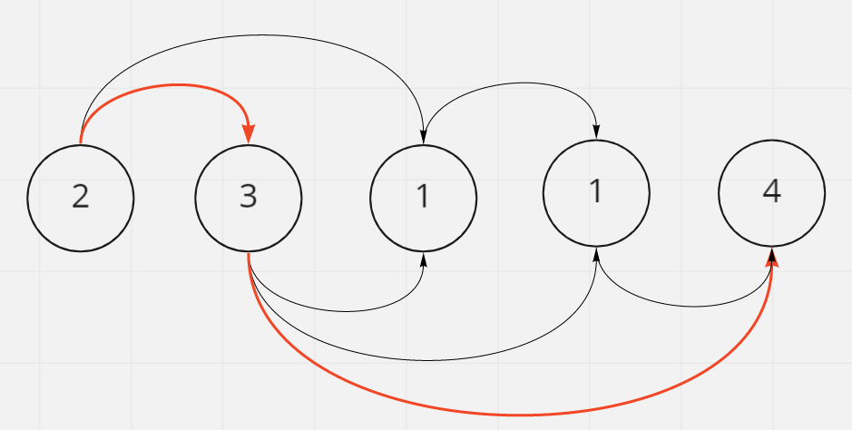
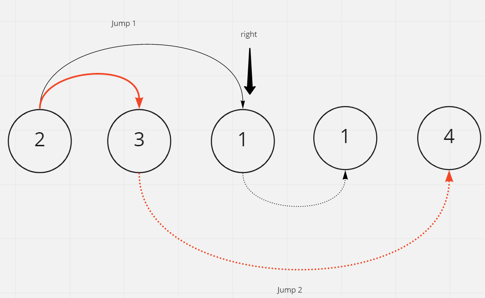

# Jump Game II

## Difficulty


## Problem:

Given an array of non-negative integers nums, you are initially positioned at the first index of the array.

Each element in the array represents your maximum jump length at that position.

Your goal is to reach the last index in the minimum number of jumps.

You can assume that you can always reach the last index.

### Example 1:

```
Input: nums = [2,3,1,1,4]
Output: 2
Explanation: The minimum number of jumps to reach the last index is 2. Jump 1 step from index 0 to 1, then 3 steps to the last index.
```

### Example 2:

```
Input: nums = [2,3,0,1,4]
Output: 2
```

### Constraints

`1 <= nums.length <= 3 * 104`

`0 <= nums[i] <= 105`

<details>
  <summary>Solutions (Click to expand)</summary>

### Explanation

#### Greedy

If we visualize the array as a directed graph where ever value _i_ has a total of _nums[i]_ different edges to different other nodes, then we can see that jumping to nodes that can lead us farther down the graph will get quicker to the end



If the starting position is `i` then we can jump to `nums[i]` different positions from `i + 1` to `i + nums[i]`. Everyone of these position, indicated by `j`, can get us as far as the `j + nums[j]` position in the array. If we want to get to end of the array quicker we want to jump to the next possible position that can get us farthest down the array. This can be indicated by `max((i + 1) + nums[i + 1], (i + 2) + nums[i + 2], ... (i + nums[i]) + nums[i + nums[i]])`

We can do this be setting a _right edge_ ,right, pointer that indicated the farthest we can go from the current jump. Between `i` and `right` we will find the jump that will get us farthest down the array where the landing position for everyone of these starting positions is `j + nums[j]`. Once we reach `right` we have traveled the farther we can from `i` and must take another jump. We will set `right` to the max of all landing position we've calculated and move right to that position as the farthest possible position we can land on. Once we reach the end of the array we will return the total number of jumps made, or time `i` met with `right`.



Time: `O(N)` Where `N` is the length of the array

Space: `O(1)`

- [JavaScript](./jump-game-ii.js)
- [TypeScript](./jump-game-ii.ts)
- [Java](./jump-game-ii.java)
- [Go](./jump-game-ii.go)
</details>
