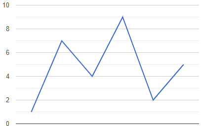
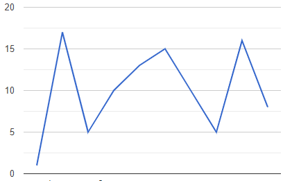

# Wiggle Subsequence

## Difficulty


## Problem

Given an integer array nums, return the length of the longest wiggle sequence.

A wiggle sequence is a sequence where the differences between successive numbers strictly alternate between positive and negative. The first difference (if one exists) may be either positive or negative. A sequence with fewer than two elements is trivially a wiggle sequence.

For example, [1, 7, 4, 9, 2, 5] is a wiggle sequence because the differences (6, -3, 5, -7, 3) are alternately positive and negative.
In contrast, [1, 4, 7, 2, 5] and [1, 7, 4, 5, 5] are not wiggle sequences, the first because its first two differences are positive and the second because its last difference is zero.
A subsequence is obtained by deleting some elements (eventually, also zero) from the original sequence, leaving the remaining elements in their original order.

### Example 1

```
Input: nums = [1,7,4,9,2,5]
Output: 6
Explanation: The entire sequence is a wiggle sequence.
```

### Example 2

```
Input: nums = [1,17,5,10,13,15,10,5,16,8]
Output: 7
Explanation: There are several subsequences that achieve this length. One is [1,17,10,13,10,16,8].
```

### Example 3

```
Input: nums = [1,2,3,4,5,6,7,8,9]
Output: 2
```

### Constraints

`1 <= nums.length <= 1000`

`0 <= nums[i] <= 1000`

<details>
  <summary>Solutions (Click to expand)</summary>

### Explanation

#### Greedy

Since we are only interested in the finding the largest subsequence we don't have to worry about finding consecutive wiggle sequences. This way we are able to skip numbers until we find the next one that fits in our wiggle subsequence.

If we look at a graph representation of a full wiggle sequence we can see that every number in the array represents a peak or valley in the graph



At every point in the array we can see that `nums[i - 1] - nums[i]` alternates between negative and positive.

For non-wiggle sequences, consecutive pairs of numbers with the same signed differences are represented as trending lines and consecutive pairs of number with no different are represented as flat lines. Since we are dealing for subsequences we can skip points that are in between flat lines and trending lines. The only points we want to count are peaks and valleys or places where `nums[i - 1] - nums[i]` is different from the changes from positive to negative or vice versa.



To do this we'll need to keep track of the last different between `nums[i - 1] - nums[i]`. If the difference is positive the next `nums[i - 1] - nums[i]` we want to count must be negative. If the difference is negative the next `nums[i - 1] - nums[i]` we want to count must be positive. If `nums[i - 1] - nums[i]` is `0` we don't want to count this point as a valley or peak. The next point where `nums[i - 1] - nums[i]` is not `0` will be the next point we want to count

The total number of elements in the subsequence is the number of points where `nums[i - 1] - nums[i]` is not `0` and alternate between positive and negative plus `1` for the single starting point

Time: `O(N)`

Space: `O(1)`

- [JavaScript](./wiggle-subsequence.js)
- [TypeScript](./wiggle-subsequence.ts)
- [Java](./wiggle-subsequence.java)
- [Go](./wiggle-subsequence.go)

</details>
