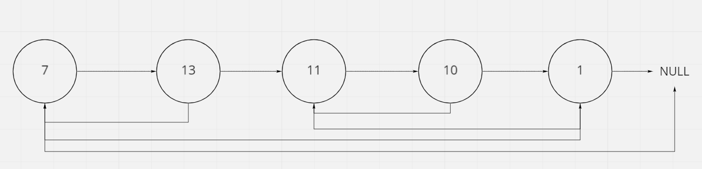
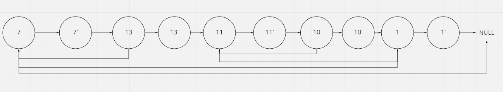
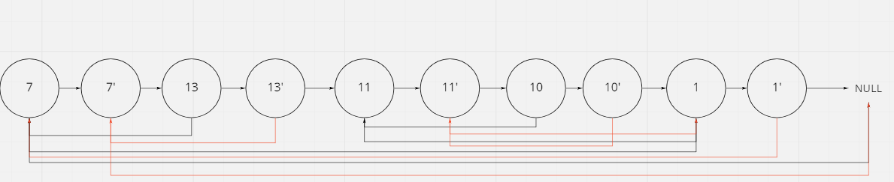
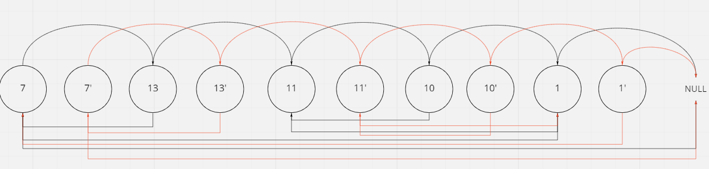

# Copy List with Random Pointer

## Difficulty


## Problem

A linked list of length n is given such that each node contains an additional random pointer, which could point to any node in the list, or null.

Construct a deep copy of the list. The deep copy should consist of exactly n brand new nodes, where each new node has its value set to the value of its corresponding original node. Both the next and random pointer of the new nodes should point to new nodes in the copied list such that the pointers in the original list and copied list represent the same list state. None of the pointers in the new list should point to nodes in the original list.

For example, if there are two nodes X and Y in the original list, where X.random --> Y, then for the corresponding two nodes x and y in the copied list, x.random --> y.

Return the head of the copied linked list.

The linked list is represented in the input/output as a list of n nodes. Each node is represented as a pair of [val, random_index] where:

- val: an integer representing Node.val
- random_index: the index of the node (range from 0 to n-1) that the random pointer points to, or null if it does not point to any node.
  Your code will only be given the head of the original linked list.

### Example 1


```
Input: head = [[7,null],[13,0],[11,4],[10,2],[1,0]]
Output: [[7,null],[13,0],[11,4],[10,2],[1,0]]
```

### Example 2


```
Input: head = [[1,1],[2,1]]
Output: [[1,1],[2,1]]
```

### Example 3


```
Input: head = [[3,null],[3,0],[3,null]]
Output: [[3,null],[3,0],[3,null]]
```

### Example 4

```
Input: head = []
Output: []
Explanation: The given linked list is empty (null pointer), so return null.
```

### Constraints

`0 <= n <= 1000`

`-10000 <= Node.val <= 10000`

`Node.random is null or is pointing to some node in the linked list`

<details>
  <summary>Solutions (Click to expand)</summary>

### Explanation

#### Mapping Nodes to Copies

If we map every Node in the list with its corresponding copy, then we can easily replicate the links that occur in the original on to the copied list.

```
Node(1) -> Node(2) -> Node(3)

map = {
  Node(1): NodeCopy(1),
  Node(2): NodeCopy(2),
  Node(3): NodeCopy(3),
}


// replicate the links of the original list with the NodeCopies

map[Node(1)].next = map[Node(1).next] // NodeCopy(1) -> NodeCopy(2)

map[Node(2)].next = map[Node(2).next] // NodeCopy(2) -> NodeCopy(3)

NodeCopy(1) -> NodeCopy(2) -> NodeCopy(3)

```

Time: `O(N*2)` Where `N` is the length of the list

Space: `O(N)`

#### Interweaving Nodes



We can come up with a similar solution without the need of a hash map by instead interweaving node copies in between the original nodes.



While the original nodes have had their `next` link modified, their `random` link remains untouched. Since we know every original node has a copy node next to it, we can easily link the next node of the current original node to the next node of the original nodes `random`



Now that we have the randoms linked up, we need to link together the original nodes and the copy nodes.

Since we know that original nodes are linked to copy nodes, we can link every original node to its `.next.next` which corresponds to the next original node and every copy node to its `.next.next` which corresponds to the next copy node



Time: `O(N*3)` Where `N` is the length of the original list

Space: `O(1)` Without counting the copy nodes as extra space

- [JavaScript](./copy-list-with-random-pointer.js)
- [TypeScript](./copy-list-with-random-pointer.ts)
- [Java](./copy-list-with-random-pointer.java)
- [Go](./copy-list-with-random-pointer.go)

</details>
