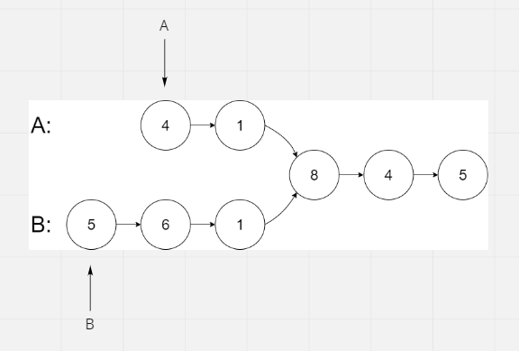
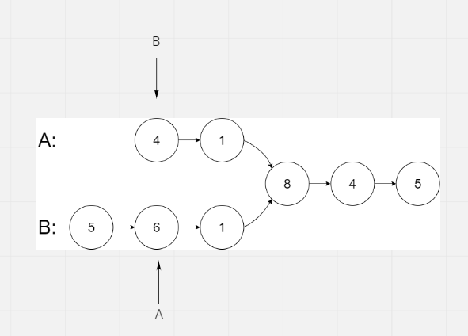
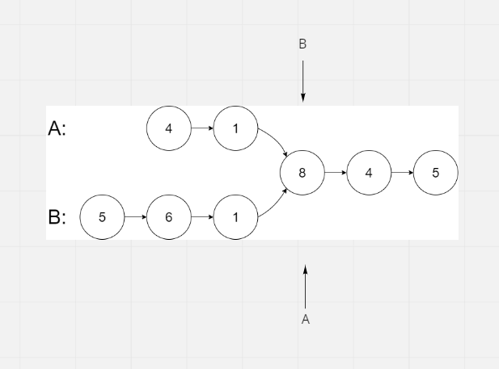

# Intersection of Two Linked Lists

## Difficulty


## Problem

Write a program to find the node at which the intersection of two singly linked lists begins.

For example, the following two linked lists:

### Example 1

```
Input: intersectVal = 8, listA = [4,1,8,4,5], listB = [5,6,1,8,4,5], skipA = 2, skipB = 3
Output: Reference of the node with value = 8
Input Explanation: The intersected node's value is 8 (note that this must not be 0 if the two lists intersect). From the head of A, it reads as [4,1,8,4,5]. From the head of B, it reads as [5,6,1,8,4,5]. There are 2 nodes before the intersected node in A; There are 3 nodes before the intersected node in B.
```

### Example 2

```
Input: intersectVal = 2, listA = [1,9,1,2,4], listB = [3,2,4], skipA = 3, skipB = 1
Output: Reference of the node with value = 2
Input Explanation: The intersected node's value is 2 (note that this must not be 0 if the two lists intersect). From the head of A, it reads as [1,9,1,2,4]. From the head of B, it reads as [3,2,4]. There are 3 nodes before the intersected node in A; There are 1 node before the intersected node in B.
```

### Example 3

```
Input: intersectVal = 0, listA = [2,6,4], listB = [1,5], skipA = 3, skipB = 2
Output: null
Input Explanation: From the head of A, it reads as [2,6,4]. From the head of B, it reads as [1,5]. Since the two lists do not intersect, intersectVal must be 0, while skipA and skipB can be arbitrary values.
Explanation: The two lists do not intersect, so return null.
```

### Constraints

`If the two linked lists have no intersection at all, return null.`

`The linked lists must retain their original structure after the function returns.`

`You may assume there are no cycles anywhere in the entire linked structure.`

`Each value on each linked list is in the range [1, 10^9].`

`Your code should preferably run in O(n) time and use only O(1) memory.`

<details>
  <summary>Solutions (Click to expand)</summary>

### Explanation

#### Difference In Length

We can separate the combined LinkedList into 3 parts

1. The shared sublist. These are the nodes that both the A list and the B list have in common
2. The A sublist. These are the nodes that are unique to A
3. The B sublist. These are the nodes that are unique to B

If we want the two lists to intersect there must be least one shared node. We will use two pointers to traverse the lists. Our goal is to get both pointers on the same shared node.



Ideally, if we were to increment both pointers at the same time we would intersect at the first shared node. However if the sublists leading up to the first shared node are not the same length then the pointers will never intersect.
This is because the `A` pointer has to travel `subListA.length` nodes to get to the first shared node and the `B` pointer has to travel `subListB.length` node to get to the first shared node.
if `subListA.length < subListB.length` then the `A` pointer will always be `subListB.length - subListA.length` ahead of the `B` pointer when both are in the shared sublist.

If we want both pointers to intersect at the first shared node then we have to make `subListA.length == subListB.length`. This would mean starting the `B` pointer `subListB.length - subListA.length` ahead of `headB`. This would effectively cause both pointers to travel the same number of nodes before intersecting at the first shared node.

Before we can do this we need to know that length of the `A` list and the `B` list. If we have `aList.length` and `bList.length` then we can find the number of node that the `A` pointer needs to travel to get its head start.

We also do the same without calculating the difference in length. If we move the `A` pointer `bList.length` nodes where we overflow `bList.length - aList.length` into the `B` list and we move the `B` pointer `bList.length` nodes where we overflow into the beginning of the `A` list, we would eventually reach a point where the both pointers are `n` nodes from the first shared node



From there on we would advance both pointers until they both intersect.



Time: `O(N + M)` Where `N` and `M` are the lengths of both lists

Space: `O(1)`

- [JavaScript](./intersection-of-two-linked-lists.js)
- [TypeScript](./intersection-of-two-linked-lists.ts)
- [Java](./intersection-of-two-linked-lists.java)
- [Go](./intersection-of-two-linked-lists.go)

</details>
