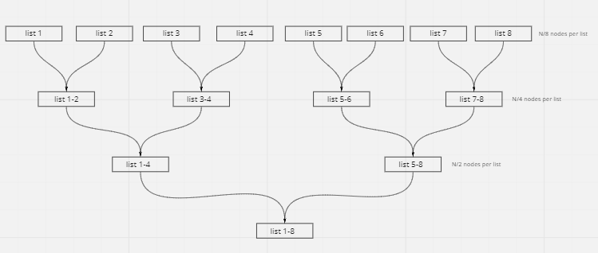

# Merge k Sorted Lists

## Difficulty

<!-- choose one -->


## Problem:

You are given an array of k linked-lists lists, each linked-list is sorted in ascending order.

Merge all the linked-lists into one sorted linked-list and return it.

<!-- any examples -->

### Example 1:

```
Input: lists = [[1,4,5],[1,3,4],[2,6]]
Output: [1,1,2,3,4,4,5,6]
Explanation: The linked-lists are:
[
  1->4->5,
  1->3->4,
  2->6
]
merging them into one sorted list:
1->1->2->3->4->4->5->6

```

### Example 2:

```
Input: lists = []
Output: []
```

### Example 3:

```
Input: lists = [[]]
Output: []
```

### Constraints

`k == lists.length`

`0 <= k <= 10^4`

`0 <= lists[i].length <= 500`

`-10^4 <= lists[i][j] <= 10^4`

`lists[i] is sorted in ascending order.`

`The sum of lists[i].length won't exceed 10^4.`

### Explanation

#### Merge One by One

The simplest solution would be to iterate over the lists one by one and merge them in a main list that will hold the final merge list

```
[1->4->5]

[
  1->3->4,
  2->6
]

[1->1->3->4->4->5]

[
  2->6
]

[1->1->2->3->4->4->5->6]

[]
```

This will cost us `O(kN)` where `k` is the number of lists and `N` is the number of comparison and merging operations. This can also only cost us `O(1)` since we can merge all lists into the first list instead of creating a new list.

#### Min Heap

We can use a Priority Queue of size `k` that will initially take the head nodes of all lists. For our comparator, we will compare the values of each node. This will "bubble up" the least of the node to the front of the queue for us to pop and insert in our result list. We can then insert the `next` node of the popped node in the queue to heapify once again.

```

Input: lists = [[1,4,5],[1,3,4],[2,6]]


[1,1,2]
 ^ pop 1 and insert the next node 4
[]

[1,2,4]
 ^ pop 1 and insert the next node 3
[1]

[2,3,4]
 ^ pop 2 and insert the next node 6
[1, 1]

[3,4,6]
 ^ pop 3 and insert the next node 4
[1 1 2]

[4,4,6]
 ^ pop 4 and insert the next node 5
[1 1 2 3]

[4,5,6]
 ^ pop 4, this is the end of list 2 in the array
[1 1 2 3 4]


[5,6]
 ^ pop 5, this is the end of list 1 in the array
[1 1 2 3 4 4]


[6]
 ^ pop 6, this is the end of the 3 list in the array
[1 1 2 3 4 4 5]


result = [1 1 2 3 4 4 5 6]
```

#### Iterative Divide and Conquer

Our main problem with the Merge One by One solution, is how may comparisons we have to make for every single list we want to merge into the bigger list. It can take up to `O(N)` comparisons, with `N` being the total number of nodes among all lists, for `k` lists in `lists` totaling up to `O(k * n)`



We can reduce the total comparisons by merging lists by pairs instead of into one list. Merging lists into pairs costs `K/2 * ((N/K) * 2)` or `O(N)` for our first round of pairs, We can then merge the resulting lists into pair and so on until we reach a final single list. At every level, we are making `O(N)` comparisons and doing that `O(log k)` times (halving the number of lists we compare at every level), Total amount of operations would end up being `O(N log k)` where `k` is number of lists and `N` is the total number of nodes.

- [JavaScript](./merge-k-sorted-lists.js)
- [TypeScript](./merge-k-sorted-lists.ts)
- [Java](./merge-k-sorted-lists.java)
- [Go](./merge-k-sorted-lists.go)
