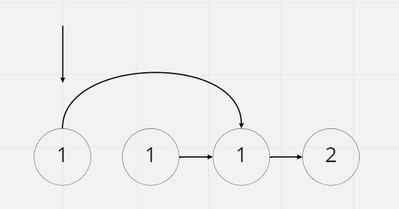
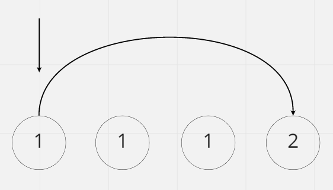

# Remove Duplicates from Sorted List

## Difficulty


## Problem

Given the head of a sorted linked list, delete all duplicates such that each element appears only once. Return the linked list sorted as well.

### Example 1


```
Input: head = [1,1,2]
Output: [1,2]
```

### Example 2


```
Input: head = [1,1,2,3,3]
Output: [1,2,3]
```

### Constraints

`The number of nodes in the list is in the range [0, 300].`

`-100 <= Node.val <= 100`

`The list is guaranteed to be sorted in ascending order.`

<details>
  <summary>Solutions (Click to expand)</summary>

### Explanation

#### Link Nodes With Next Unique

In a sorted list duplicate nodes are next to each other. If we want to remove duplicate nodes from the list we need to go through the list and for every unique node check if there is a duplicate right next to it. If there is relink the node with the node after that. If that node is a duplicate link it with the node after that. This would go one until we find the next NON NULL node or we reach the end of the list.





Time: `O(N)` Where `N` is the length of the list

Space: `O(1)`

- [JavaScript](./remove-duplicates-from-sorted-list.js)
- [TypeScript](./remove-duplicates-from-sorted-list.ts)
- [Java](./remove-duplicates-from-sorted-list.java)
- [Go](./remove-duplicates-from-sorted-list.go)

</details>
