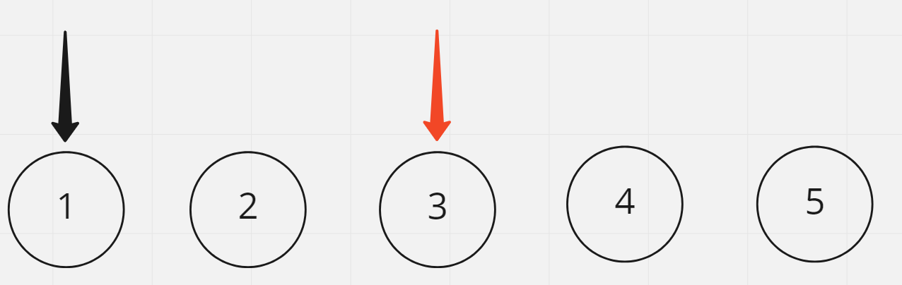
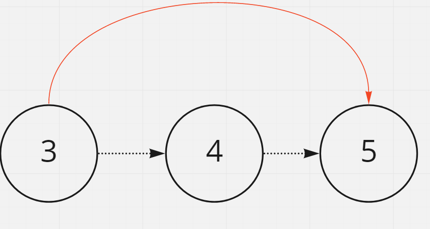
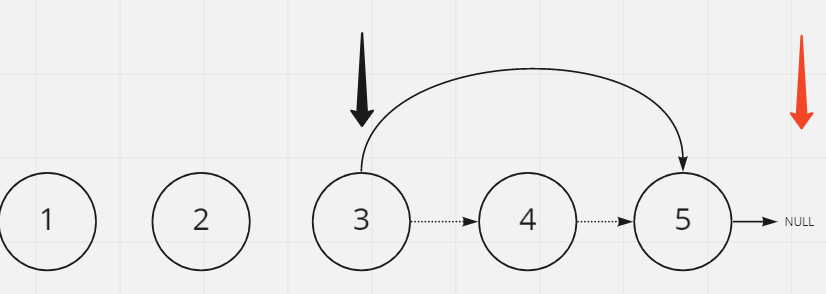

# Remove Nth Node From End of List

## Difficulty


## Problem

Given the head of a linked list, remove the nth node from the end of the list and return its head.

Follow up: Could you do this in one pass?

### Example 1


```
Input: head = [1,2,3,4,5], n = 2
Output: [1,2,3,5]
```

### Example 2

```
Input: head = [1], n = 1
Output: []
```

### Example 3

```
Input: head = [1], n = 1
Output: []
```

### Constraints

`The number of nodes in the list is sz.`

`1 <= sz <= 30`

`0 <= Node.val <= 100`

`1 <= n <= sz`

<details>
  <summary>Solutions (Click to expand)</summary>

### Explanation

#### Fast and Slow pointer

If we have two pointers, one `slow` and one `fast`, where the slow pointer is always `n` position behind `fast` then when `fast` at the end `slow` will be `n` positions from the end.



Removing a node from a singly-linked list involves breaking the link between the node's previous node and linking the previous node the node's next node



If we want to remove the _nth_ node from the end we'll need to relink the `n - 1` node from the end with the next node.

For the solution we'll advance the `fast` pointer `n + 1` times. This will setup the a gap of `n` node in between the `fast` and `slow` pointers. Once the `fast` pointer is finished moving we will advance both the `slow` and `fast` pointer until `fast` points to the end of the list, `null`. At this point `slow` will be at the `n + 1` node from the end which the node before the node we want to remove. We will relink the node with the node after the node we want to remove which can be expressed as `slow.next = slow.next.next`



Time: `O(N)` Where `N` is the length of the list

Space:`O(1)`

- [JavaScript](./remove-nth-node-from-end-of-list.js)
- [TypeScript](./remove-nth-node-from-end-of-list.ts)
- [Java](./remove-nth-node-from-end-of-list.java)
- [Go](./remove-nth-node-from-end-of-list.go)

</details>
