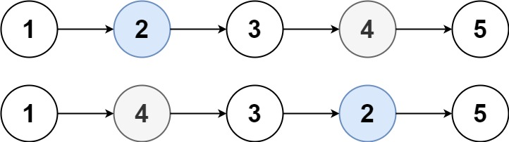

# Swapping Nodes in a Linked List

## Difficulty


## Problem

You are given the head of a linked list, and an integer k.

Return the head of the linked list after swapping the values of the kth node from the beginning and the kth node from the end (the list is 1-indexed).

### Example 1



```
Input: head = [1,2,3,4,5], k = 2
Output: [1,4,3,2,5]
```

### Example 2

```
Input: head = [7,9,6,6,7,8,3,0,9,5], k = 5
Output: [7,9,6,6,8,7,3,0,9,5]
```

### Example 3

```
Input: head = [1], k = 1
Output: [1]
```

### Example 4

```
Input: head = [1,2], k = 1
Output: [2,1]
```

### Example 5

```
Input: head = [1,2,3], k = 2
Output: [1,2,3]
```

### Constraints

`The number of nodes in the list is n.`

`1 <= k <= n <= 105`

`0 <= Node.val <= 100`

<details>
  <summary>Solutions (Click to expand)</summary>

### Explanation

#### Convert To List

If we can convert the LinkedList into an list then swapping the list node would be as simple as swapping the element at the `kth - 1` and the element at the `list.length - kth` and rebuilding the list.

We can convert the LinkedList into an array using an iterator that will travrse all the nodes and push them into a list along the way. With the newly constrcuted list we will swap the nodes. Afterwards we would still need to convert it back to a list which involves iteratin over the list and linking every node with its neighboring node and the last node with `null`

Time: `O(2 * N)` Where `N` is the length of the LinkedList

Space `O(N)`

#### Three Pointers

When using a list we can easily find the positions of the `kth` elements from the beginning and end by using `k - 1` and `list.length - k`. Since we are using a LinkedList the length is not given which forces us to **_search_** for these nodes in the list. Doing this in one pass would involve using three pointers.

1. The "beginning" pointer would be used to locate the `kth` node from the beginning. This would be done be by moving `k - 1` nodes from the `head`

2. The "fast" pointer would act as the end marker for the list. The `kth` node from the end would be found by backtracking `k - 1` from this node

3. The "slow" pointer would would be use to locate the `kth` node from the end. Since we can't backtrack in a Singly LinkedList we will have a slow pointer that will always be `k - 1` behind the fast pointer. That way when we simultaneously move the slow and fast pointers and the fast pointer reaches the end of the list, the slow pointer will be at the `k - 1th` node from the end of the list

```
k = 2

[1     2     3     4     5]
       ^           ^     ^
      beg.       slow   fast
```

Once we have the pointers in the right position, we can swap the values of the nodes at the beg. and slow pointers.

Time: `O(N)`

Space: `O(1)`

#### Five Pointers Without Swapping Values

The previous solution involves swapping the values of the nodes which may or may not be wanted. If want to swap the nodes themselves then we would need to have reference to the `beg` and `slow` previous nodes.

To do this we can just initialize two new pointer that will start just before the head node and will essentially follow their next node. A dummy that links to the next node can be made as a starting point for these nodes.

```
k = 2

[dummy        1        2        3        4        5]
   x          ^                 x        ^        ^

```

Once the `beg` and `slow` pointers are at their positions we would need to swap the node by:

1. link `beg` previous node with `slow`
2. link `slow` previous node with `beg`
3. link `beg` with `slow` next node
4. link `slow` witn `beg` next node

Time: `O(N)`

Space: `O(1)`

- [JavaScript](./swapping-nodes-in-a-linked-list.js)
- [TypeScript](./swapping-nodes-in-a-linked-list.ts)
- [Java](./swapping-nodes-in-a-linked-list.java)
- [Go](./swapping-nodes-in-a-linked-list.go)

</details>
