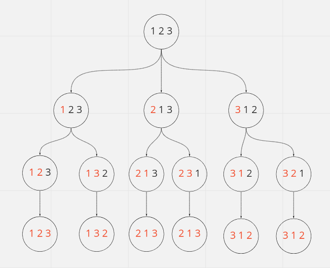

# Permutation Sequence

## Difficulty


## Problem

The set [1, 2, 3, ..., n] contains a total of n! unique permutations.

By listing and labeling all of the permutations in order, we get the following sequence for n = 3:

1. "123"
2. "132"
3. "213"
4. "231"
5. "312"
6. "321"
   Given n and k, return the kth permutation sequence.

### Example 1

```
Input: n = 3, k = 3
Output: "213"
```

### Example 2

```
Input: n = 4, k = 9
Output: "2314"
```

### Example 3

```
Input: n = 3, k = 1
Output: "123"
```

### Constraints

`1 <= n <= 9`

`1 <= k <= n!`

<details>
  <summary>Solutions (Click to expand)</summary>

### Explanation

#### Permutation Tree

If we visualize the possible permutations as a tree we can divide the tree into multiple sub-problems



We can see that a tree of `n` numbers can be divided into `n` sub trees with `n - 1` subtrees each. We can say that `permutations(3)` lists all `3!` or `6` permutations of `1,2,3`. We can then divide it in to 3 sub problems where every number becomes a prefix.

```
1 + permutations(2,3)

2 + permutations(1,3)

3 + permutations(1,2)
```

If we divide further we can reach a base case where the result of `permutation(x)` is always `x`

```
1 + 2 + permutation(3) // 123
1 + 3 + permutation(2) // 132

2 + 1 + permutation(3) // 213
2 + 3 + permutation(1) // 231

3 + 1 + permutation(2) // 312
3 + 2 + permutation(1) // 321
```

If we can think of finding the _kth_ permutation as traversing to the `k` indexed leaf node, then we can find the _kth_ permutation with having to generate `k` permutations with backtracking.

To know which node to traverse to we'll need a way to group the permutations. If `n!` permutations can be grouped into `n` trees each with `(n - 1)!` nodes, we can find the index of the subtree to traverse to by doing `(k - 1) / (n - 1)!`. We can find the next number to insert into our permutation by doing `index + 1`

After doing so we'll need to bring `k` inbounds of the new subtree by doing `(k - 1) % (n - 1)`

After traversing `n` nodes, we would have built our permutation.

Time: `O(N^2)` Where `N` is `n`

Space: `O(N)`

- [JavaScript](./permutation-sequence.js)
- [TypeScript](./permutation-sequence.ts)
- [Java](./permutation-sequence.java)
- [Go](./permutation-sequence.go)

</details>
