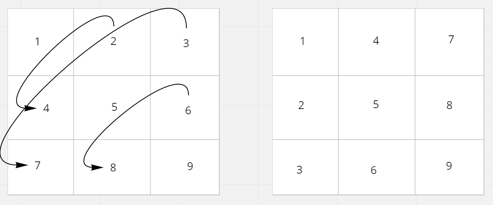
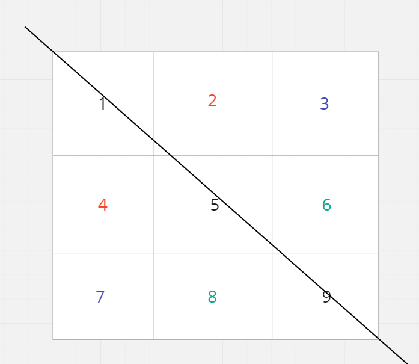
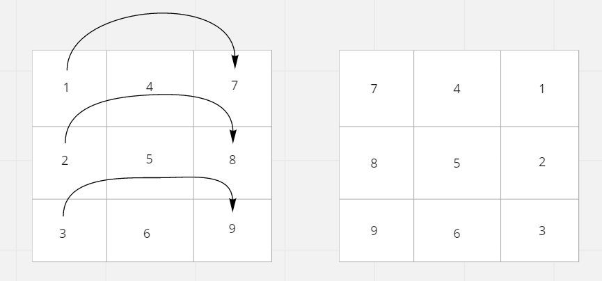
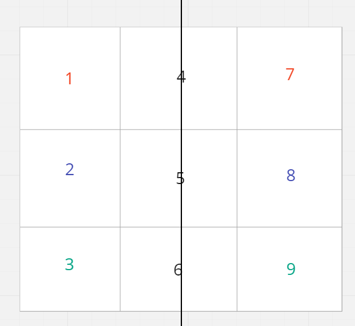

# Rotate Image

## Difficulty


## Problem

You are given an n x n 2D matrix representing an image, rotate the image by 90 degrees (clockwise).

You have to rotate the image in-place, which means you have to modify the input 2D matrix directly. DO NOT allocate another 2D matrix and do the rotation.

### Example 1


```
Input: matrix = [[1,2,3],[4,5,6],[7,8,9]]
Output: [[7,4,1],[8,5,2],[9,6,3]]
```

### Example 2


```
Input: matrix = [[5,1,9,11],[2,4,8,10],[13,3,6,7],[15,14,12,16]]
Output: [[15,13,2,5],[14,3,4,1],[12,6,8,9],[16,7,10,11]]
```

### Example 3

```
Input: matrix = [[1]]
Output: [[1]]
```

### Example 4

```
Input: matrix = [[1,2],[3,4]]
Output: [[3,1],[4,2]]
```

### Constraints

`matrix.length == n`

`matrix[i].length == n`

`1 <= n <= 20`

`-1000 <= matrix[i][j] <= 1000`

<details>
  <summary>Solutions (Click to expand)</summary>

### Explanation

#### Transpose and Reflect

Rotating a matrix by `90` degrees requires us to turn all the columns into rows and vice versa. We can do this by **transposing** the matrix.



This involves swapping cells with their reflection along the diagonal axis



In doing so, we've essentially created a reversed version of a rotated matrix. We can reverse it again by reflecting it along the y axis



This involves swapping cells with their reflection along the y axis



Time: `O(N)` Where `N` is the total number of cells in the matrix

Space: `O(1)`

- [JavaScript](./rotate-image.js)
- [TypeScript](./rotate-image.ts)
- [Java](./rotate-image.java)
- [Go](./rotate-image.go)

</details>
