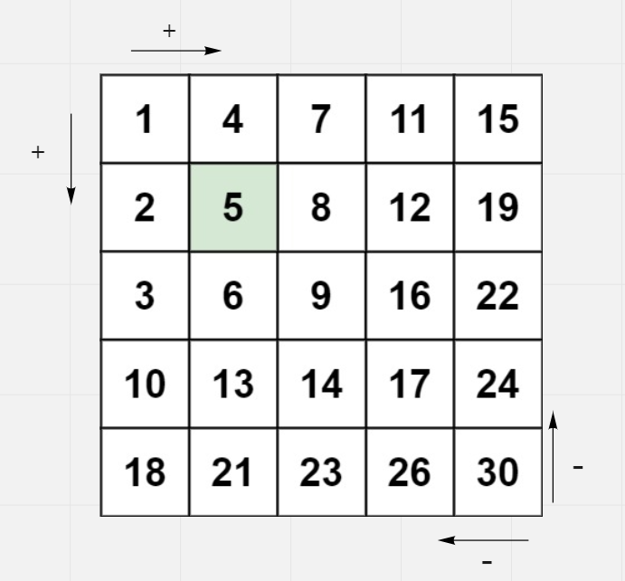
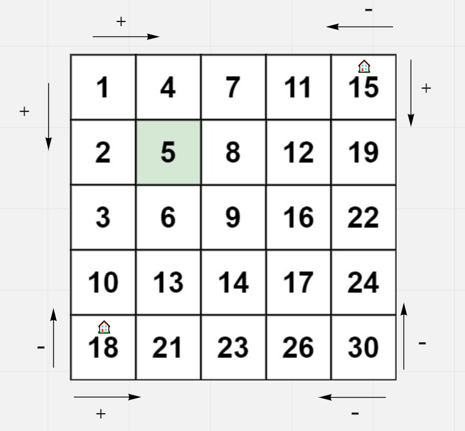
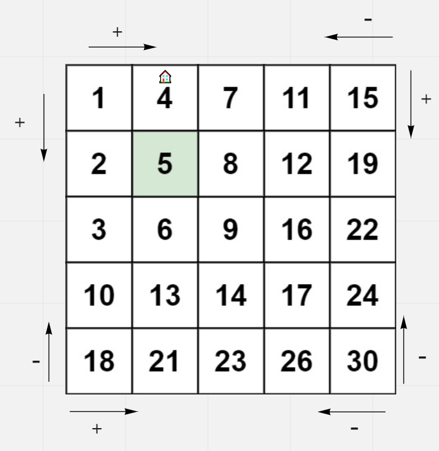
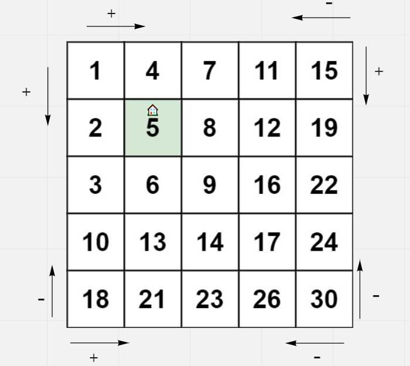
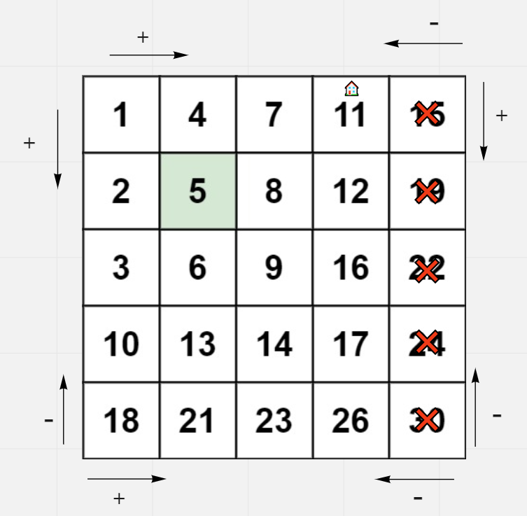
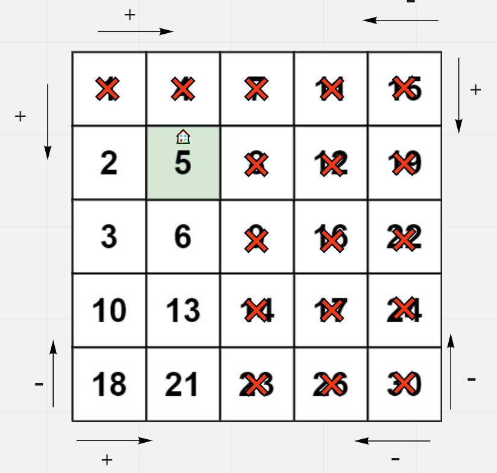

# Search a 2D Matrix II

## Difficulty


## Problem

Write an efficient algorithm that searches for a target value in an m x n integer matrix. The matrix has the following properties:

- Integers in each row are sorted in ascending from left to right.
- Integers in each column are sorted in ascending from top to bottom.

### Example 1


```
Input: matrix = [[1,4,7,11,15],[2,5,8,12,19],[3,6,9,16,22],[10,13,14,17,24],[18,21,23,26,30]], target = 5
Output: true
```

### Example 2


```
Input: matrix = [[1,4,7,11,15],[2,5,8,12,19],[3,6,9,16,22],[10,13,14,17,24],[18,21,23,26,30]], target = 20
Output: false
```

### Constraints

`m == matrix.length`

`n == matrix[i].length`

`1 <= n, m <= 300`

`-109 <= matix[i][j] <= 109`

`All the integers in each row are sorted in ascending order.`

`All the integers in each column are sorted in ascending order.`

`-109 <= target <= 109`

<details>
  <summary>Solutions (Click to expand)</summary>

### Explanation

#### Top Right / Bottom Left Traversal

##### Intuition

The key here is to realize the relation between a cell and its neighbors. Take any cell in the matrix and compare it with its left, right, top, and bottom neighbors (if in bounds). You see the all the neighboring top and left neighboring cells are less than or equal to the home cell and all the right and bottom neighboring cells are greater than or equal to the home cell. From this we can come up with a simple rule:

1. If the current cell is greater than the target, move left or up
2. If the current cell is smaller than the target, move right or down



This is further proven by the positions of the smallest and greatest cells in the matrix. The top left cell has no left or top neighbors meaning there are no cells that are less than it. The bottom right cell has not right or bottom neighbors meaning that there are not cells that are greater than it. Both of these positions are less than ideal starting points since there are two possible paths, we can take both going in once direction. If we were to take this approach it would take some backtracking since the number of possible paths increase exponentially.

If we look at other possible positions we are left with the top right and bottom left cells. Conveniently these two cells have both types of neighboring cells. With these cells we can freely be able to traverse the matrix picking the optimal path depending on how the current compares with the target



##### Procedure

> _for a top right starting position_

1. If the current cell is greater than the target, move left
2. If the current cell is smaller than the target, move down.

For example, if we were to traverse our example matrix, we would traverse left until we reach `4` the first cell that is smaller than the target



And traverse downwards until we find the target



##### Proof

If we look at our traversal in terms of pointers to row and columns, we can see that our traversal is merely reducing the size of the grid. If `i, j` represents the position of the top right cell, then `i` can be considered the max number of the _ith_ row and `j` can be considered the min number of the _jth_ column. If the number at cell `i, j` is greater than the target, then we know that all cells in the _jth_ column or cells `i, j...h-1` (where `h` is the height of the matrix) are all greater than the target. We can exclude that entire column from our matrix.



If we apply this to our previous example, then we know that the first 3 column from the left **all** contain cells that are greater than the target


Similarly if the number at cell `i, j` is smaller than the target, then we know that all the cells in the _ith_ row or cells `i...w-1, j` (where `w` is the width of the matrix) are all smaller than the target. We can exclude the entire row.



In our example we can exclude first partial row (indexed `[0 0],[0 1]`) since we know all the cells in that row are smaller than the target.

If the target is in the cell, we will eventually reach a position all the cells in the current remaining row are equal to or less than the target and all the cells in the remaining column are greater than or equal to the target.

If the target is not in the cell, then our pointers would eventually reach out of bounds indicating that all rows and columns only contain cells with numbers that are greater than or less than the target.

Time: `O(N + M)` Where `N` is the height of the matrix and `M` is the width of the matrix

Space: `O(1)`

- [JavaScript](./search-a-2d-matrix-ii.js)
- [TypeScript](./search-a-2d-matrix-ii.ts)
- [Java](./search-a-2d-matrix-ii.java)
- [Go](./search-a-2d-matrix-ii.go)

</details>
