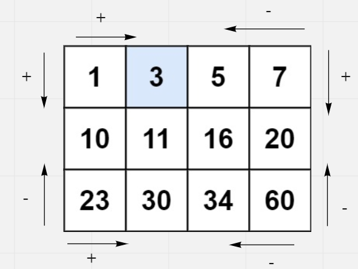
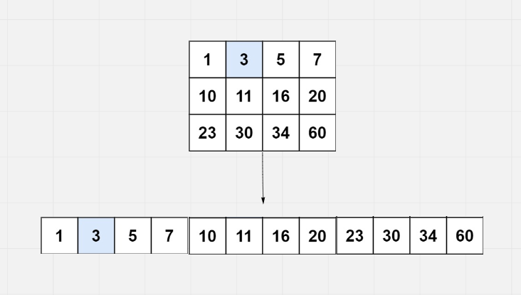

# Search a 2D Matrix

## Difficulty


## Problem

Write an efficient algorithm that searches for a value in an m x n matrix. This matrix has the following properties:

Integers in each row are sorted from left to right.
The first integer of each row is greater than the last integer of the previous row.

### Example 1

```
Input: matrix = [[1,3,5,7],[10,11,16,20],[23,30,34,60]], target = 3
Output: true
```

### Example 2

```
Input: matrix = [[1,3,5,7],[10,11,16,20],[23,30,34,60]], target = 13
Output: false
```

### Constraints

`m == matrix.length`

`n == matrix[i].length`

`1 <= m, n <= 100`

`-104 <= matrix[i][j], target <= 104`

<details>
  <summary>Solutions (Click to expand)</summary>

### Explanation

#### Rows and Columns as Bounds

If we look at how every row and column sorts its numbers, we can see that the smallest numbers of every row appear at the beginning and the greatest appear at the end. Likewise for every column the greatest numbers appear at the bottom and the smallest at the top. We can use this to our advantage for **_searching_** for our target in the matrix.

We'll first need a starting point. The top left and bottom right are less than ideal starting points since they offer one path either increase or decrease the current cell value. Top right and bottom left offer better starting points since they offer two paths to get closer to the target.



By starting at the top right we can say that `matrix[i][j]` is

1. The greatest number in the _ith_ row
2. The smallest number in the _jth_ column

If `matrix[i][j]` is greater than the target then we can exclude the _jth_ column from our search area. If `matrix[i][j]` is greater than the target then we can exclude the _ith_ row from our search area. By doing this we are effectively using the rows and columns as bounds for matrix until we either:

1. Find the target
2. Exclude all the rows
3. Exclude all the columns

Time: `O(N + M)` Where `N` and `M` are the number of rows and columns of the matrix

Space: `O(1)`

#### Binary Search

If we look at our matrix as a sliced up sorted array then we know we can just use binary search to search for our target.



We'll need a way to access the cell at the midpoint. Since we know that `n * m` cell are divided into `n` rows each of `m` length, we can find the middle cell by taking the row where we can find the cell `matrix[mid / m]` and finding its index with in the `m` number of cells in the row `matrix[mid / m][mid % m]`.

If our `left` or right pointers of our binary search ever cross over, then the target is not in the matrix

Time: `O(log(N * M))` Where `N` and `M` are the number of rows and columns of the matrix

Space: `O(1)`

- [JavaScript](./search-a-2d-matrix.js)
- [TypeScript](./search-a-2d-matrix.ts)
- [Java](./search-a-2d-matrix.java)
- [Go](./search-a-2d-matrix.go)

</details>
