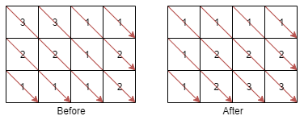

# Sort the Matrix Diagonally

## Difficulty


## Problem:

A matrix diagonal is a diagonal line of cells starting from some cell in either the topmost row or leftmost column and going in the bottom-right direction until reaching the matrix's end. For example, the matrix diagonal starting from mat[2][0], where mat is a 6 x 3 matrix, includes cells mat[2][0], mat[3][1], and mat[4][2].

Given an m x n matrix mat of integers, sort each matrix diagonal in ascending order and return the resulting matrix.

### Example 1:



```
Input: mat = [[3,3,1,1],[2,2,1,2],[1,1,1,2]]
Output: [[1,1,1,1],[1,2,2,2],[1,2,3,3]]

```

### Constraints

`m == mat.length`

`n == mat[i].length`

`1 <= m, n <= 100`

`1 <= mat[i][j] <= 100`

<details>
  <summary>Solutions (Click to expand)</summary>

### Explanation

#### Diagonal lists and sorting

If we want to get all the diagonals of a matrix, we would need to know how to traverse a matrix diagonally. This largely depends on the direct you need to go, but for top-left to bottom-right diagonals we can get from cell `mat[i][j]` to the next cell `mat[i + 1][j + 1]` by incrementing our `y` axis index `i` and incrementing our `x`axis index `j` each by one. This will continue until there are no more cells in the current diagonals or when `i` or `j` are outside the bounds of the matrix.


We can now traverse the matrix diagonally at every possible starting points and construct a list out of all the cells we traverse and sort the list.

```
[3,0,0]
[0,2,0]
[0,0,1]

[3,2,1]

sort..

[1 2 3]
```

We'll now have insert the values back into the diagonal in the now sorted order. Since we know that ending point of the current diagonal, we can start at that point, replace the existing value with the last value in our list, pop the last value from the array repeat the operations going back up the diagonal. Since we know how to traverse down the diagonal `i + 1, j + i` we also know how to traverse up the diagonal, `i - 1, j - 1`.

```
[3,0,0]
[0,2,0]
[0,0,1]

[1 2 3]

[1,0,0]
[0,2,0]
[0,0,3]
```

time: O((M + N) _ min(M, N) _ log(min(M, N)))

Where M and N are the height and widths of the matrix

space: O(min(M, N))

#### Map of Min Heaps/Sorted Lists

We can make use of a map that will group lists of all our cell values by which diagonal they are are a part of. As we observed in the previous solution, we can traverse a diagonal by adding `1` to the x axis pointer `i` and the y axis pointer `j`.

If we group together the cell indices for every diagonal we can make an observation about their indices.

```
[0,0 0,1 0,2]
[1,0 1,1 1,2]
[2,0 2,1 2,2]

diagonal 1: [2,0]

diagonal 2: [1,0 2,1]

diagonal 3: [0,0 1,1 2,2]

diagonal 4: [0,1 1,2]

diagonal 5: [0,2]
```

If for every index pair we get the difference between both indices, we can see that the differences are the same within every list

```
diagonal 1: [2]

diagonal 2: [1 1]

diagonal 3: [0 0 0]

diagonal 4: [-1 -1]

diagonal 5: [-2]
```

This means that instead of traversing the matrix diagonals, we can traverse the matrix normally and put the cell values into hash maps of lists depending on the difference of the `i` and `j` indices

```
[3,3,1]
[2,2,1]
[1,1,1]

{
  2 : [1]

  1 : [2 1]

  0 : [3 2 1]

  -1: [3 1]

  -2: [1]
}
```

We then sort every list in our hash map, and traverse the matrix list again, this time we are going to replace the values in the matrix. For every cell, we will find the difference between its indices and access the corresponding list in the hash. We will take the next smallest value in the list, the first one, and remove that value from the list. We will than replace the existing value in the cell with the new value from the list.

As an optimization, we can replace the list in the map with min heaps or priority queues since these operations are better suited for a sorted queue-like data structure. This means we can skip the sorting step since polling the queue will always give us the next smallest value.

time: O(N _ M _ log(min(N,M)))
space: O(N \* M)

- [JavaScript](./sort-the-matrix-diagonally.js)
- [TypeScript](./sort-the-matrix-diagonally.ts)
- [Java](./sort-the-matrix-diagonally.java)
- [Go](./sort-the-matrix-diagonally.go)
</details>
