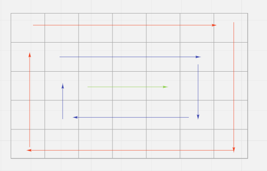
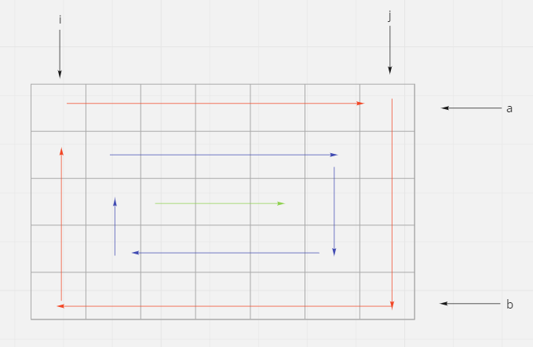

# Spiral Matrix

## Difficulty


## Problem

Given an m x n matrix, return all elements of the matrix in spiral order.

### Example 1


```
Input: matrix = [[1,2,3],[4,5,6],[7,8,9]]
Output: [1,2,3,6,9,8,7,4,5]
```

### Example 2


```
Input: matrix = [[1,2,3,4],[5,6,7,8],[9,10,11,12]]
Output: [1,2,3,4,8,12,11,10,9,5,6,7]
```

### Constraints

`m == matrix.length`

`n == matrix[i].length`

`1 <= m, n <= 10`

`-100 <= matrix[i][j] <= 100`

<details>
  <summary>Solutions (Click to expand)</summary>

### Explanation

#### Traverse Levels

If we look at an example of a spiral traversal, we can see that we can group cells into levels where all nodes of one level are surrounded by nodes of another level.



If we traverse every level in a clockwise direction we can record all of the cells in spiral order. This can be done by having four pointers:

1. `i`, will keep track of the left most column of the current level.
2. `j`, will keep track of the right most column of the current level.
3. `a`, will keep track of highest row of the current level.
4. `b`, will keep track of the lowest row of the current level.



We will traverse the level starting from traversing all cells between in row `a` between `i` and `j`. Next all nodes from in column `j` between `a + 1` to `b` will be traversed. If the current level has a height and width of more than 1 or `i < j` and `a < b`, then there are more cells to traverse in the level. We'll start by traversing all the cells in row `b` between `j` and `i`. Next we'll traverse all nodes in column `i` between `b - 1` and `a + 1`.

After we reach the last cell of the current level, we'll move all our pointers inward and repeat traversing the levels. This will go on until any of the pairs of pointers cross each other.

Time: `O(N)` Where `N` is the total size of the matrix

Space: `O(1)`

- [JavaScript](./spiral-matrix.js)
- [TypeScript](./spiral-matrix.ts)
- [Java](./spiral-matrix.java)
- [Go](./spiral-matrix.go)

</details>
