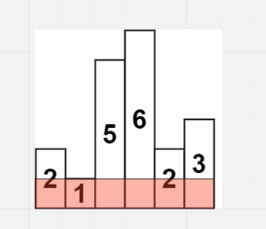
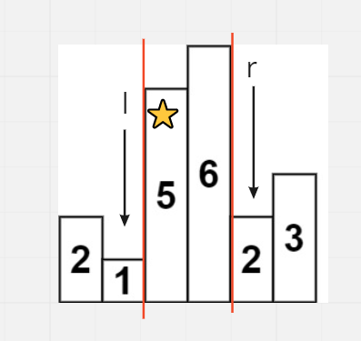
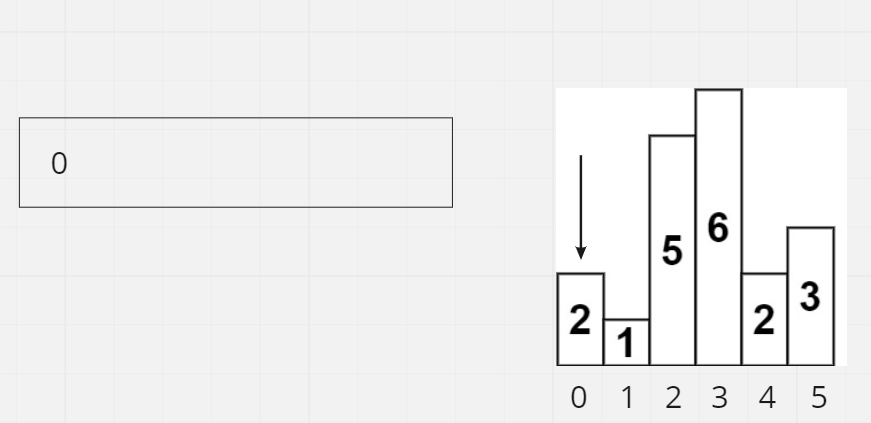
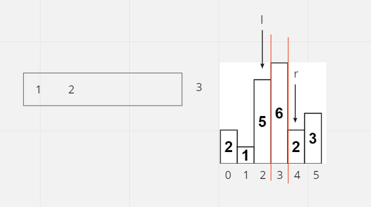
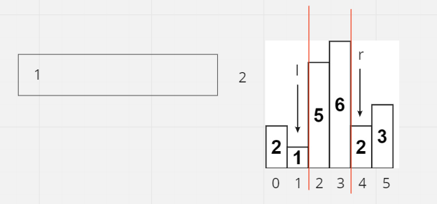

# Largest Rectangle in Histogram

## Difficulty


## Problem

Given an array of integers heights representing the histogram's bar height where the width of each bar is 1, return the area of the largest rectangle in the histogram.

### Example 1

```
Input: heights = [2,1,5,6,2,3]
Output: 10
Explanation: The above is a histogram where width of each bar is 1.
The largest rectangle is shown in the red area, which has an area = 10 units.
```

### Example 2

```
Input: heights = [2,4]
Output: 4
```

### Constraints

`1 <= heights.length <= 105`

`0 <= heights[i] <= 104`

<details>
  <summary>Solutions (Click to expand)</summary>

### Explanation

#### Dynamic Programming

If we try to take the area of a rectangle that includes all of the bars in the histogram, we can see that it can be calculated as `min(heights) * (heights.length)`.



This means that a rectangles areas is largely dependent on:

1. The height of the smallest bar within the rectangle

2. The number of bars in the rectangle

For our greedy strategy we will, for every `heights[i]` in `heights` we will find the largest rectangle we can make as `heights[i]` being the smallest and where the rectangle takes in the most number of bars as possible.

To construct a rectangle out of every bar in the histogram we will need to include every neighboring bar to the left and right of `heights[i]` that is `heights[i] >= heights[r]` where `r > i` and `heights[i] >= heights[l]` where `l < i`. Our two boundary bars will be the first bars to the left and right of `i` that is less than `heights[i]`. The length of the rectangle will be `r - l - 1` and the height will be `heights[i]`. The area can be calculated as `heights[i] * (r - l - 1)`



To calculate the max area rectangle we can make out of `heights[i]` we can do an outwards search from `i` to find the left and right boundaries of the rectangle. This will cost us at most `O(N^2)` operations for possibly traversing the entier array for every `heights[i]`.

If we are interested in finding the closest bars to the left and right that are smaller that the current bar then we can use the boundaries found for previous bars to help us find the boundary for the current bar. For example if we have a histogram of `[1 5 4 3 2 1 2 3 4 5 1]` and we want to find the left boundary for `heights[5]` (which is 1), then would have to traverse the entire left half of the arary until we reach `heights[0]`. Instead we can use the left boundary found for `heights[4]` to help us jump to the next smallest bar to the left. If this bar is smaller than the current bar then we can assume that `heights[4]` and `heights[5]` have the same left boundary.

To do this we would need to traverse the array twice. Once left to right to get all of the left boundaries and once right to left to get all of the right boudaries. We will use 2 arrays both of length `heights.length` to store the left and right boundaries for each bar in the array. Once we've travsed all the arrays twice we will go throught `heights` once more to calculate the max rectangles for every bar in the array which can be calculated as `heights[i] * (rightBoundary - leftBoundary - 1)` to find the max area rectangle we can make out of the histogram

Time: `O(3 * N)` avg. Where `N` is the length of `heights`.

Space: `O(2 * N)`

#### Stack

Similar to how we used arrays to find the left and right edges for the max retangle for every bar, we can use a stack. If we have a sequence of bars that gradually increase or stay the same in height then we can say that for every `heights[i]` we can find its left boundary at `heights[i - 1]` (this is also true for consecutive bars that are the same height). As we are iterating over the array we'll add the bars to our stack.



Whenever we come across a bar `heights[i]` that is smaller than the bar at top of the stack `heights[j]`, we can use `heights[i]` as the right boundary for `heights[j]`. This is because `heights[i]` is the first bar to the right that is smaller than `heights[j]`. Once we pop out `heights[j]` the left boundary will be at the top of the stack. This is because bars in the stack are greater than or equal to their left neighbor. This means we can use `heights[k]` as the left edge where `k` is the top of the stack after popping `i` from the stack.



Using `i`, `j`, and `k` we can calculate the area as `heights[i] * (heights[j] - heights[k] - 1)` where `i` is the index of the current bar whose max area we are trying to calculate, `j` is the index of the right boundary or the first bar to the right that is less than `heights[i]` and `k` is the index of the left boundary of the first bar to the left that is less than `heights[j]` (`j` defaults to `-1`).



Once there are no more bars in the stack that are `> heights[i]` we can add `heights[i]` to find its right boundary. By the end of iterating to the end of `heights[i]` and calculating the max areas for all the bars in the stack, we would have found the max area.

Time: `O(2 * N)` Where `N` is the length of `heights`. For every bar in the stack we will insert it into the stack and pop it from the stack.

Space:  `O(N)`

- [JavaScript](./largest-rectangle-in-histogram.js)
- [TypeScript](./largest-rectangle-in-histogram.ts)
- [Java](./largest-rectangle-in-histogram.java)
- [Go](./largest-rectangle-in-histogram.go)

</details>
