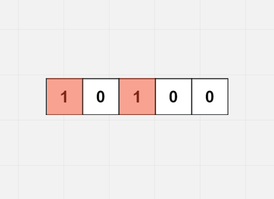
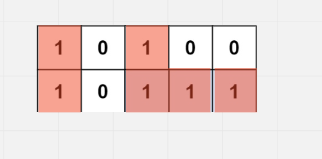
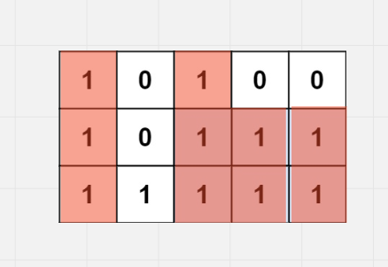
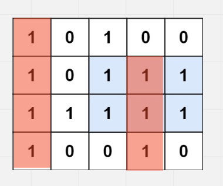

# Maximal Rectangle

## Difficulty


## Problem

Given a rows x cols binary matrix filled with 0's and 1's, find the largest rectangle containing only 1's and return its area.

### Example 1


```
Input: matrix = [["1","0","1","0","0"],["1","0","1","1","1"],["1","1","1","1","1"],["1","0","0","1","0"]]
Output: 6
Explanation: The maximal rectangle is shown in the above picture.
```

### Example 2

```
Input: matrix = []
Output: 0
```

### Example 3

```
Input: matrix = [["0"]]
Output: 0
```

### Example 4

```
Input: matrix = [["1"]]
Output: 1
```

### Example 5

```
Input: matrix = [["0","0"]]
Output: 0
```

### Constraints

`rows == matrix.length`

`cols == matrix[i].length`

`0 <= row, cols <= 200`

`matrix[i][j] is '0' or '1'.`

<details>
  <summary>Solutions (Click to expand)</summary>

### Explanation

#### Maximal Height At Every Level

This solution uses the same algorithm used in [Largest Rectangle In Histogram](../largest-rectangle-in-histogram) for solving subproblems.

If we interpert the matrix as `l` different bars of `'1'`s where `l` is `matrix.length` and the height of each bar is the number of consecutive `'1'`s starting from the bottom of each bar, then we can find the max rectagle by finding the max rectangle we can make out of the `l` different bars.
If we were to store the heights of each bar in `heights` where the height of the `i` bar is `heights[i]` then we could simply solve this problem by using the stack based algorithm of finding the `leftEdge` and the `rightEdge` of each bar in `heights` where `heights[leftEdge], heights[rightEdge] >= heights[i]` and `leftEdge < i > rightEdge`

However is we were to calculate the heights of each bar based on the number of consecutive cells that contian `'1'` starting from the bottom on the bar `matrix[0].length - 1`, then we would exclude bars that have a starting point at `i >= 0 && i < matrix[0].length - 1`. To take this into account we would need to traverse every `i` level of the matrix as if it were the bottom of the matrix and find the max rectangle we can make out of the `l` bars that have a height of the number consecutive cells starting from `matrix[i]`.

To keep track of the heights of the bars at each level, we would have `heights` that would have the height of the `i` bar at `heights[i]`. At every cell we visit, we would check if `matrix[level][i] == '1'` if it is the bar has a height of `1`. By the second level of the matrix if `matrix[level][i] == '1'` and `heights[i]` is already `1` then the `heights[i]` would be incremented by one. This way we would keep track of the number of consecutive cells that contain `'1'`. If `matrix[level][i] == '0'` `heights[i]` is set to a height of `0`









Time: `O(N * (2 * M))` Where `N` is the height of the matrix and `M` is the length.

Space: `O(2 * M)`

- [JavaScript](./maximal-rectangle.js)
- [TypeScript](./maximal-rectangle.ts)
- [Java](./maximal-rectangle.java)
- [Go](./maximal-rectangle.go)

</details>
