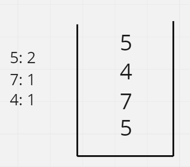

# Maximum Frequency Stack

## Difficulty


## Problem:

Implement FreqStack, a class which simulates the operation of a stack-like data structure.

FreqStack has two functions:

- `push(int x)`, which pushes an integer x onto the stack.
- `pop()`, which removes and returns the most frequent element in the stack.
  - If there is a tie for most frequent element, the element closest to the top of the stack is removed and returned.

### Example 1

```
Input:
["FreqStack","push","push","push","push","push","push","pop","pop","pop","pop"],
[[],[5],[7],[5],[7],[4],[5],[],[],[],[]]
Output: [null,null,null,null,null,null,null,5,7,5,4]
Explanation:
After making six .push operations, the stack is [5,7,5,7,4,5] from bottom to top.  Then:

pop() -> returns 5, as 5 is the most frequent.
The stack becomes [5,7,5,7,4].

pop() -> returns 7, as 5 and 7 is the most frequent, but 7 is closest to the top.
The stack becomes [5,7,5,4].

pop() -> returns 5.
The stack becomes [5,7,4].

pop() -> returns 4.
The stack becomes [5,7].
```

### Constraints

`Calls to FreqStack.push(int x) will be such that 0 <= x <= 10^9.`

`It is guaranteed that FreqStack.pop() won't be called if the stack has zero elements.`

`The total number of FreqStack.push calls will not exceed 10000 in a single test case.`

`The total number of FreqStack.pop calls will not exceed 10000 in a single test case.`

`The total number of FreqStack.push and FreqStack.pop calls will not exceed 150000 across all test cases.`

<details>
  <summary>Solutions (Click to expand)</summary>

### Explanation

#### Stack of Stacks

In the `FreqStack` description, element order is determined by element frequency and push order with the former taking precedent. This means that elements with the greatest frequency must appear at the top of the stack regardless of push order. This means that pushing a brand new element in the stack after pushing an element with a frequency of `2` would put the new element in behind the element with the greater frequency

For example pushing the sequence of elements `[5],[7],[5],[4]`, into the stack would result in `4` being placed before `5` even though we pushed `4` after `5`




In a way we can think of the `FreqStack` as an abstraction for a stack of stacks where entries are organized into levels depending on what the frequency of the number of its kind was when entered into the stack.


Using this structure we can the top of the stack will always represent:

- The most frequent element in the stack

  - The most recently pushed entry in the stack

Where frequency is prioritized over order.

Pushing new elements is as simple as pushing the new entry into the right stack. Elements are organized into stacks based on their frequency in the `FreqStack` at the time of pushing. Meaning pushing the `3rd` element of its kind into the stack would push it into the `3rd` sub-stack. Since stacks are indexable, we are able to pick specific stacks to push elements into

##### `FreqStack()`

Initialize a `HashMap<Integer, Integer>` for recording the frequencies of elements in the `FreqStack` and a `Stack<Stack<Integer>>` to store sub-stacks

##### `push(int x)`

`x`'s frequencies would get update in the `HashMap`, if there is not an existing key for it it would be created and initialized to `1`.

If the new `x` frequency exceeds the number of sub-stack then a new sub-stack would need to be added.

The new entry of `x` would be pushed to the correct sub-stack.

##### `pop()`

Take the top sub-stack and pop its top element. This will be the element to return. Update the frequency in the `HashMap` and remove its key if its no longer needed. If after popping the top of the top stack reduces its size to zero, pop the top stack.

Time: `O(1)`

Space: `O(N)` Where `N` is the number of entries pushed into the stack.

- [JavaScript](./maximum-frequency-stack.js)
- [TypeScript](./maximum-frequency-stack.ts)
- [Java](./maximum-frequency-stack.java)
- [Go](./maximum-frequency-stack.go)

</details>
