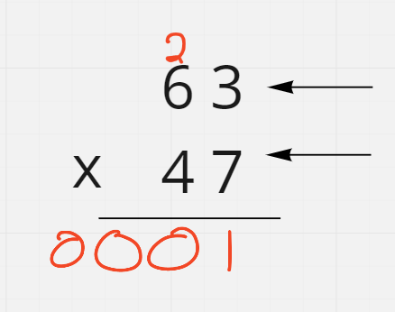
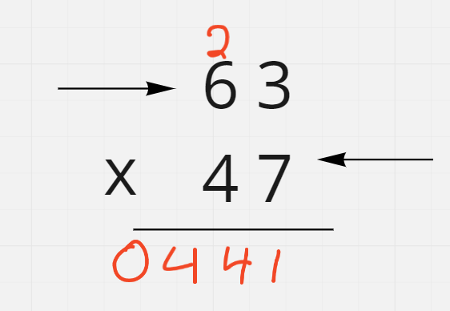

# Multiply Strings

## Difficulty


## Problem

Given two non-negative integers num1 and num2 represented as strings, return the product of num1 and num2, also represented as a string.

Note: You must not use any built-in BigInteger library or convert the inputs to integer directly.

### Example 1

```
Input: num1 = "2", num2 = "3"
Output: "6"
```

### Example 2

```
Input: num1 = "123", num2 = "456"
Output: "56088"
```

### Constraints

`1 <= num1.length, num2.length <= 200`

`num1 and num2 consist of digits only.`

`Both num1 and num2 do not contain any leading zero, except the number 0 itself.`

<details>
  <summary>Solutions (Click to expand)</summary>

### Explanation

#### Long Multiplication

In long multiplication, we multiply every single digit of one number with the digits of another and add the product to the correct place of the result.

For example in `63 x 47`



The ones place of both numbers are multiplied resulting in `21`. since the every place can only hold numbers up to `9`, `1` be added to the ones place and 2 would be carried over to the tens places.

For the next two numbers, `4 x 3` where were multiplying the number in the tens place of the first number with the number in the ones place of the second number, the product would be placed in the tens place.



We'll aim to replicate the same approach but by iterating over strings of numbers. To do this we'll need some representation of "places" which an array will work. The product of two numbers cannot exceed the sum of the two numbers' length (as shown by `99 x 99 = 9801`), we'll create an array of size `n + m` where `n` is the length of the number and `m` is the length of the second number.

Similar to long multiplication, we'll start by iterating over the first number in reverse. The digits of the first number we'll need to be multiplied by the digits of the second number in reverse as well.

For every two digits, we'll store the product in the array at index `i + j + 1` where `i` is the index of the first numbers current digit, and `j` is the index of the second numbers current digit. This placement works since the product of 2 digits in the ones places indexed at `i = 1` and `j = 1` results in an index of `1 + 1 + 1 = 3` in the array, which is equivalent to the right most digit

```
index   0 1

       "6 3" <-
       "4 7" <-

i = 1
j = 1
i + j + 1 = 3

  [0 0 0 21]
```

The same procedure would continue for the rest of the digits. By the end, the array will have all the products at their correct place. But since at this point the values at these indices may contain numbers greater than `9`, we'll need to carry over some values to make sure every index contains numbers that are `< 10`

```
63 x 47

[0 24 54 21]

carry over...

[2 9 6 1]
```

By the end the array will contain all the digits in their correct place. Remove all the leading `0` and convert to a string.

Time: `O(N * M)` Where `N` and `M` are the lengths of the two digits

Space: `O(N * M)`

- [JavaScript](./multiply-strings.js)
- [TypeScript](./multiply-strings.ts)
- [Java](./multiply-strings.java)
- [Go](./multiply-strings.go)

</details>
