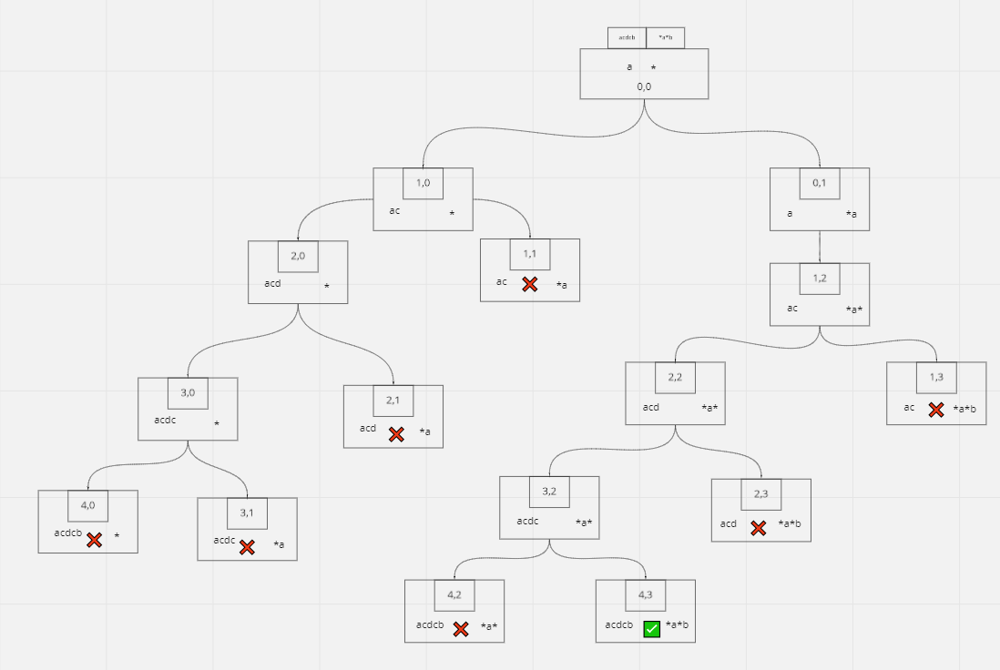

# Wildcard Matching

## Difficulty


## Problem:

Given an input string (s) and a pattern (p), implement wildcard pattern matching with support for '?' and '\*' where:

- '?' Matches any single character.
- '\*' Matches any sequence of characters (including the empty sequence).

The matching should cover the entire input string (not partial).

### Example 1:

```
Input: s = "aa", p = "a"
Output: false
Explanation: "a" does not match the entire string "aa".
```

### Example 2:

```
Input: s = "aa", p = "*"
Output: true
Explanation: '*' matches any sequence.
```

### Example 3:

```
Input: s = "cb", p = "?a"
Output: false
Explanation: '?' matches 'c', but the second letter is 'a', which does not match 'b'.
```

### Example 4:

```
Input: s = "adceb", p = "*a*b"
Output: true
Explanation: The first '*' matches the empty sequence, while the second '*' matches the substring "dce".
```

### Example 5:

```
Input: s = "acdcb", p = "a*c?b"
Output: false
```

### Constraints

`0 <= s.length, p.length <= 2000`

`s contains only lowercase English letters.`

`p contains only lowercase English letters, '?' or '*'.`

<details>
  <summary>Solutions (Click to expand)</summary>

### Explanation

#### Top down iterative Dynamic Programming

To fully understand the problem here, we have to understand the possibilities that `*` provides.

Every time, we reach a `*` in `p` we can:

1. Match we one or more characters from `s`
2. Match no characters from `s`

This leaves us with multiple possibilities to match `p` with `s`. Take the following case when matching the string using a linear approach.

```
p = "*a*b"

s = "acdcb"
```

Our first characters are `*` and `a`. We can:

1. Match `"a"` with `"*"` and try to match the next character of `s`, `"c"`.
2. Do not match `"a"` with `"*"`, try to match the next character of `"p"` with `"a"`

If we are working with pointers, where `i` represents the pointer for `s` and `j` represents with pointer for `p`:

1. Move `i`, do not move `j`
2. Move `j`, do not move `i`

Here is the decision tree we can come up with for `acdcb` and `*a*b`.



We can think of tree traversals as different linear comparisons of the two string. We can try to account for every possibility using recursive function calls, but this causes us to make many repeated comparison or "tree traversals". We can instead reuse memoized comparisons to make new comparisons.

Our DP grid will follow the following structure.

1. Size of `s.length + 1 * p.length + 1` where `+ 1` accounts for empty string comparisons

2. `dp[i][j]` will be a `boolean` value representing the comparison of substring `s(0, i)` with substring `p(0, j)`,

3. Comparison of `s(0,0)` `p(0,0)`, or empty strings, will always be true

We will build the dp iteratively using the following rules:

1. if `i` is `0` and `s[j]` is a `*`, the cell will be `true` if the previous substring is also matched with `*`

2. if `j` is 0, the cell will always be `false`, we cannot match a character with an empty pattern

3. if `p[j]` is `*` we can match with any previous substring if either of them are valid

4. if `s[i]` and `p[j]` match or `p[j]` is `?` we can match if the two previous characters of `s` and `p` are match

By the time we fill our dp, the bottom right cell will contain our result for fully comparing `s` with `p`

Time: `O(S*P)`
Space: `O(S*P)`

S and P being the lengths of strings `s` and `p`

#### Two pointer backtracking

This solution revolves around taking a greedy approach, with greedy meaning `*`s will match little characters as possible. This means whenever we encounter `*` we will always move `p` pointer by itself, indicating that no characters were matched in `s` with `*`

```
*a*b
^
acdcb
^
// move p

*a*b
 ^
acdcb
^
// a and a match move both

*a*b
  ^
acdcb
 ^
// move p

*a*b
   ^
acdcb
 ^
// no match
```

If we ever come a point where we don't have a match in characters after a `*`, we'll want the `*` to match or "eat up" characters. To do this we'll need a reference to the position of the last `*` and the position in `s` where a character and `*` were compared. we'll backtrack both our indices and this time increment our `s` pointer by one. This indicates that a character was matched with `*`. The comparisons and backtracking will continue until we reach the end of both `s` and `p` or the end of `s` where the rest of characters in `p` are all `*`

time: worst case O(S\*P)

space: O(1)

- [JavaScript](./wildcard-matching.js)
- [TypeScript](./wildcard-matching.ts)
- [Java](./wildcard-matching.java)
- [Go](./wildcard-matching.go)
</details>
