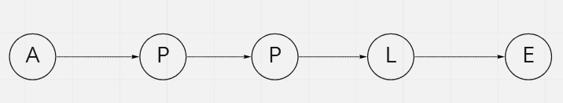
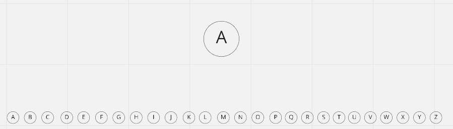
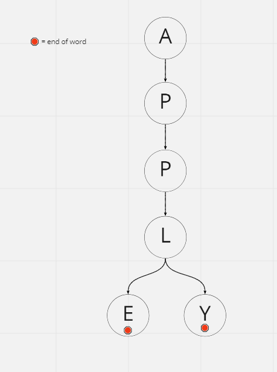
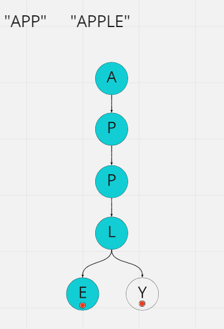
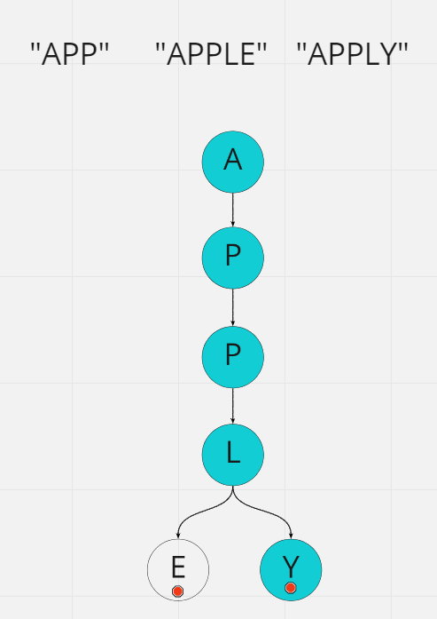
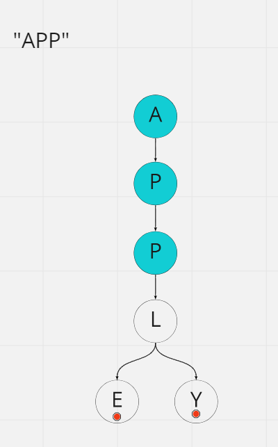

# Implement Trie (Prefix Tree)

## Difficulty


## Problem

Implement a trie with insert, search, and startsWith methods.

### Example 1

```
Trie trie = new Trie();

trie.insert("apple");
trie.search("apple");   // returns true
trie.search("app");     // returns false
trie.startsWith("app"); // returns true
trie.insert("app");
trie.search("app");     // returns true
```

### Constraints

`You may assume that all inputs are consist of lowercase letters a-z.`

`All inputs are guaranteed to be non-empty strings.`

<details>
  <summary>Solutions (Click to expand)</summary>

### Explanation

#### Intuition

If we think of a way we can represent a string as a graph, we think of a sequence of nodes that represent each character of the string and are linked to together (similar to a LinkedList)

`"Apple"`



We can use this model to represent words/strings as an abstract data type. If we want a single structure to represent one word then this is all we need. But if we want to represent multiple words using a single structure we'll need our nodes to point to multiple nodes preferably to the `26` letters of the alphabet



Every node will have a collection of `26` potential child nodes that represent every letter of the alphabet. Those child nodes will also have their own child nodes creating a sequence of nodes that represent words.

If we want to build a Trie of words, we would need to insert the characters of the string as Nodes one by one where the character are linked to their following character as child nodes. For ending characters, we can mark the node as an ending node indicating that it is the ending character of a word in the Trie. This ending node may or may not be a leaf node.

That way we can search for a word in a Trie by iterating over the characters of a string and checking for nodes linked in the correct order. We can reuse existing nodes to represent similar prefixes of to words. For example `APPLE` and `APPLY` can both be partially represented with the same prefix tree

```
A -> P -> P -> L
```

Since the last word both word are different we need the last node to link to two different nodes, `E` and `Y`



Here we can find both words `"APPLE"` and `"APPLY"` by traversing down the Trie searching for the words one character at a time giving us a `O(M)` look up where `M` is the length of the word





Also searchable in the Trie are prefixes. Prefixes here are sequences of nodes that do not have an ending node but are part of a much bigger tree of nodes. For example `"APP"` is a prefix of `"APPLE"` and `"APPLY"`. In the Trie `"APP"` is a sequence of node that starts at the root but ends before any ending node.



#### Implementation

##### `Trie`

Before creating a `Trie` class we'll need to create the building block of the `Trie`, `Nodes`. These `Nodes` will have a couple properties.

1. The character the node represents

2. Indication that it is an ending node

3. A collection of links to its child nodes

We will initialize our `Trie` instantiating a single root node. Since we don't want our `Trie` to contain words that all that with the same letter we will create a neutral root node that links to starting letter nodes

##### `insert(string word)`

Given a string we want to insert into the `Trie` we will iterate over every character of the string and starting right after the root node, we will creating a sequence of `Nodes` that are linked to each other. In order to reuse parts of the tree we will first check if the nodes are already in the tree. If they are then we won't create a new node and simply traverse the tree. If they are not then we will need to create child nodes that will link to parent nodes. Once at the final character of the word, we will mark the last node as an ending node indicating that it is the end of a word contained in the `Trie`

##### `search(string word)`

We will simply traverse the `Trie` by checking if the characters sequences of the word exists in the `Trie` and if the final `Node` of the word is marked as an ending `Node`

##### `startsWith(string prefix)`

Prefixes are not necessarily words but character sequences that exists as the result of inserting words into the `Trie`. Since prefixes do not have to be inserted into the `Trie` to exists the last character `Node` does not have to be an ending `Node`.

We will follow the same procedure for searching for words in the `Trie` but without checking for the ending `Node`.

Time: `O(M)` Where `M` is the average length of the words inserted/searched

Space: `O(N*M)` Where `M` is the average length of the words inserted and `N` is the number of words inserted

- [JavaScript](./implement-trie-prefix-tree.js)
- [TypeScript](./implement-trie-prefix-tree.ts)
- [Java](./implement-trie-prefix-tree.java)
- [Go](./implement-trie-prefix-tree.go)

</details>
